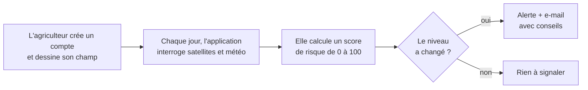
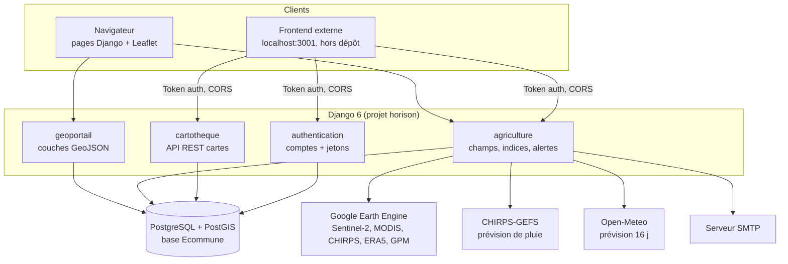
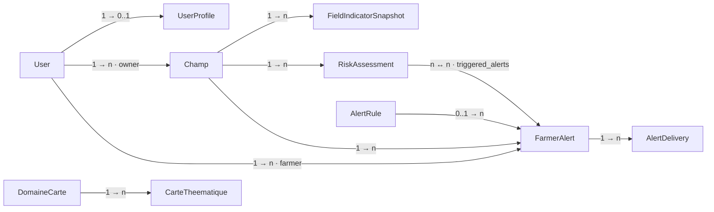
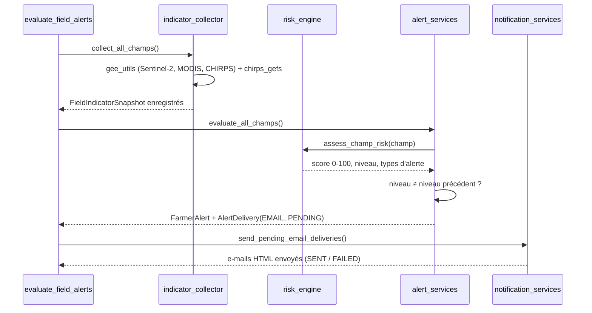
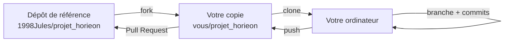

# Documentation complète : E-commune Horison

Géoportail et surveillance agricole de la commune de **Blitta 2** (préfecture
de Blitta, région Centrale, Togo).

Ce document s'adresse à plusieurs publics :

- **Parties 1 et 2** : toute personne, même sans connaissances en
  programmation, qui veut comprendre ce que fait l'application, puis
  l'installer et la lancer sur son ordinateur.
- **Partie 3** : les développeurs qui veulent comprendre comment le code est
  construit (base de données, API, système d'alertes, sources de données).
- **Partie 4** : celles et ceux qui veulent faire évoluer le projet.

Le fichier [README.md](README.md) reste la référence courte. Ce document est la
version détaillée. Il existe aussi en PDF mis en page :
[docs/Documentation_E-commune.pdf](docs/Documentation_E-commune.pdf).

---

## Sommaire

**[Partie 1 : Comprendre le projet](#partie-1--comprendre-le-projet)** (pour tout le monde)

1. [À quoi sert E-commune ?](#1-à-quoi-sert-e-commune-)
2. [Le géoportail : la carte de la commune](#2-le-géoportail--la-carte-de-la-commune)
3. [Le module agriculture : surveiller ses champs par satellite](#3-le-module-agriculture--surveiller-ses-champs-par-satellite)
4. [La cartothèque : les cartes thématiques](#4-la-cartothèque--les-cartes-thématiques)
5. [L'administration](#5-ladministration)
6. [Ce que l'application ne fait pas (encore)](#6-ce-que-lapplication-ne-fait-pas-encore)
7. [Lexique](#7-lexique)

**[Partie 2 : Installer et lancer le projet](#partie-2--installer-et-lancer-le-projet)** (pas à pas)

8. [Ce qu'il faut installer](#8-ce-quil-faut-installer)
9. [Récupérer le code](#9-récupérer-le-code)
10. [Lancer la base de données](#10-lancer-la-base-de-données)
11. [Préparer Python](#11-préparer-python)
12. [Configurer le fichier .env](#12-configurer-le-fichier-env)
13. [Créer la base, charger les données, créer un compte admin](#13-créer-la-base-charger-les-données-créer-un-compte-admin)
14. [Lancer le serveur](#14-lancer-le-serveur)
15. [Activer le module agriculture (Google Earth Engine)](#15-activer-le-module-agriculture-google-earth-engine)
16. [Activer les e-mails d'alerte](#16-activer-les-e-mails-dalerte)
17. [Automatiser les alertes quotidiennes](#17-automatiser-les-alertes-quotidiennes)
18. [Relancer le projet les jours suivants](#18-relancer-le-projet-les-jours-suivants)
19. [Installation sous Linux](#19-installation-sous-linux)
20. [Dépannage](#20-dépannage)

**[Partie 3 : Documentation technique](#partie-3--documentation-technique)** (pour les développeurs)

21. [Vue d'ensemble](#21-vue-densemble)
22. [Arborescence](#22-arborescence)
23. [Configuration (settings)](#23-configuration-settings)
24. [Base de données](#24-base-de-données)
25. [API et routes](#25-api-et-routes)
26. [Système d'alertes agricoles](#26-système-dalertes-agricoles)
27. [Données et sources](#27-données-et-sources)
28. [Front-end](#28-front-end)
29. [Commandes de gestion](#29-commandes-de-gestion)
30. [Sécurité](#30-sécurité)

**[Partie 4 : Améliorer le projet](#partie-4--améliorer-le-projet)** (pour les contributeurs)

31. [Proposer une modification (fork et Pull Request)](#31-proposer-une-modification-fork-et-pull-request)
32. [Recettes pas à pas](#32-recettes-pas-à-pas)
33. [Limites connues](#33-limites-connues)
34. [Feuille de route proposée](#34-feuille-de-route-proposée)
35. [Contribuer sans coder](#35-contribuer-sans-coder)

---

# Partie 1 : Comprendre le projet


> Ce guide s'adresse à **tout le monde** : élus, agents municipaux,
> agriculteurs, étudiants, curieux. Aucune connaissance en informatique n'est
> nécessaire.


## 1. À quoi sert E-commune ?

Une mairie a besoin de **savoir où se trouvent les choses** sur son territoire
pour bien décider : où construire une nouvelle école, quel village est loin
d'un centre de santé, quelle piste mérite d'être réhabilitée, où manque l'eau
potable…

**E-commune** rassemble ces informations sur **une seule carte**, consultable
depuis un navigateur internet (Chrome, Firefox, Edge…), sans rien installer
sur l'ordinateur de l'utilisateur.

L'application a trois parties :

| Partie | En une phrase | Pour qui |
|---|---|---|
| **Géoportail** | La carte des infrastructures de la commune | Mairie, services techniques, population |
| **Agriculture** | La surveillance des champs par satellite, avec des alertes | Agriculteurs, coopératives, services agricoles |
| **Cartothèque** | Une bibliothèque de cartes thématiques prêtes à consulter ou imprimer | Mairie, partenaires, grand public |

### La commune couverte : Blitta 2

Blitta 2 est l'une des trois communes de la **préfecture de Blitta** (région
Centrale du Togo). Elle regroupe quatre **cantons** :

| Canton | Rôle |
|---|---|
| **Agbandi** | chef-lieu de la commune |
| **Langabou** | traversé par la route nationale N1 |
| **Koffiti** | |
| **Tcharè-Baou** | |

Cette composition est fixée par le décret publié au *Journal officiel de la
République togolaise* du 8 janvier 2018.

---

## 2. Le géoportail : la carte de la commune

Adresse : **`/geoportail/`** (par exemple http://127.0.0.1:8000/geoportail/ sur
l'ordinateur où l'application est lancée).

### Ce qu'on voit

- **Un fond de carte** au choix : *OpenStreetMap* (plan), *Satellite* (photo
  aérienne) ou *Hybride* (photo + noms).
- **Les limites** : le contour de la commune et de ses 4 cantons (en orange).
- **Les routes** : la route nationale revêtue en **rouge épais**, les pistes
  rurales en **pointillés noirs**.
- **Les infrastructures**, représentées par des petites icônes :

| Thème | Couches |
|---|---|
| Infrastructure | Lycées, collèges, jardins d'enfants, marchés |
| Hydrographie | Points d'eau autonomes (forages, puits), bornes-fontaines, châteaux d'eau |
| Santé | Formations sanitaires (USP, CMS, hôpitaux) |
| Sport et loisirs | Stades et terrains de sport |
| Agriculture | Coopératives, magasins d'intrants |

### Comment l'utiliser

1. **Se déplacer** : cliquer-glisser sur la carte. **Zoomer** : molette de la
   souris ou boutons `+` / `−` en bas à droite.
2. **Afficher des couches** : cliquer sur l'icône orange **« couches »** en haut
   à droite, puis choisir un **thème** (Santé, Infrastructure…). Changer de
   fond de carte au même endroit.
3. **Obtenir des informations** : cliquer sur une icône ou un tracé. Une bulle
   s'ouvre avec le nom, le canton, la localité, etc.
4. **Rechercher** : bouton **🔍 Rechercher** en haut, puis taper un nom (par
   exemple « Agbandi » ou « Lycée »).
5. **Outils SIG** (panneau de gauche, bouton `≡`) :
   - **📍 Localiser** : centrer la carte sur votre position (si votre appareil
     le permet) ;
   - **✏️ Dessiner** : tracer un point, une ligne ou une zone sur la carte ;
   - **📐 Mesurer** : mesurer une distance ou une surface ;
   - **Filtres & Stats** : compter les infrastructures par canton et par thème
     (combien de lycées dans le canton de Langabou ?…).

### D'où viennent les informations ?

- **À l'origine**, l'équipe du projet a relevé les données sur le terrain
  (nom des marchés, jour de marché, photos…). Ces données sont dans la base de
  données de l'auteur du projet, **pas dans le code source**.
- **Sur une nouvelle installation**, une commande reconstruit la carte à partir
  de **sources publiques** : limites officielles des Nations unies (OCHA),
  **OpenStreetMap** (la « Wikipédia des cartes », alimentée par des bénévoles)
  et l'inventaire des centres de santé de l'**OMS**.

Conséquence : certaines informations peuvent manquer ou être incomplètes.
Quand une donnée n'est pas connue, la carte affiche **« Non renseigné »** au
lieu d'inventer une valeur. **Chacun peut améliorer OpenStreetMap**
(https://www.openstreetmap.org) : les ajouts faits là-bas seront repris au
prochain import.

---

## 3. Le module agriculture : surveiller ses champs par satellite

### L'idée

Des satellites (Sentinel-2 de l'Agence spatiale européenne, MODIS de la NASA…)
photographient le Togo tous les quelques jours. En analysant les couleurs de
ces images, on peut savoir si une plante est **verte et en bonne santé** ou
**jaunie et stressée**. En y ajoutant les **relevés de pluie** et les
**prévisions météo**, on peut anticiper une sécheresse ou une inondation.

### Comment ça marche, étape par étape



1. **L'agriculteur crée un compte** et **dessine son champ** sur la carte, en
   indiquant la culture (maïs, igname…) et la date de semis.
2. **Chaque jour** (tâche automatique, par défaut à 6 h), l'application
   récupère pour chaque champ :
   - la **santé de la végétation** (indices NDVI, EVI, MSAVI) ;
   - l'**humidité** de la végétation (NDWI) ;
   - la **sécheresse** mesurée et prévue (SPI, VCI, TCI, VHI) ;
   - la **pluie** tombée (24 h, 72 h) et **prévue** (16 jours).
3. Elle combine ces indicateurs en **un score de risque de 0 à 100** :

   | Score | Niveau | Signification |
   |---|---|---|
   | 0 – 25 | 🟢 **Normal** | Tout va bien |
   | 26 – 50 | 🟡 **Vigilance** | À surveiller |
   | 51 – 75 | 🟠 **Alerte** | Agir est recommandé |
   | 76 – 100 | 🔴 **Critique** | Agir en urgence |

4. **Une alerte n'est envoyée que si le niveau change** (aggravation ou
   amélioration). On ne reçoit donc pas le même e-mail tous les jours.
5. L'e-mail explique **ce qui ne va pas** (stress hydrique, sécheresse, excès
   de pluie…), **quels indicateurs** l'ont révélé, et donne une
   **recommandation**.

### Le calendrier cultural

L'application contient aussi un **calendrier cultural** : pour chaque culture,
les mois de semis, de sarclage et de récolte, et la durée du cycle. Un
**simulateur de croissance** indique à quel stade devrait être la culture
N jours après le semis.

### À savoir

- Cette partie a besoin d'un **accès à Google Earth Engine** (service gratuit
  pour la recherche et l'usage non commercial) et d'une **adresse e-mail
  d'envoi**. Sans eux, les calculs satellites et les e-mails ne fonctionnent
  pas. Voir [le guide d'installation](#15-activer-le-module-agriculture-google-earth-engine).
- L'interface complète pour les agriculteurs (création de compte, dessin des
  champs, tableau de bord) est une **application séparée** (« frontend »), qui
  n'est pas dans ce dépôt. Ce dépôt contient le **serveur** (« backend ») qui
  fait les calculs et fournit les données.

---

## 4. La cartothèque : les cartes thématiques

La cartothèque est une **bibliothèque de cartes** déjà mises en page
(population, santé, éducation, agriculture…), classées par **domaine**. Chaque
carte a un titre, une description, une image, une échelle, un auteur, une
source et un statut (brouillon / publiée). Certaines peuvent être payantes.

Les cartes s'ajoutent depuis l'**administration** ; elles sont ensuite
disponibles pour l'application frontend via l'adresse `/api/cartotheque/`.

---

## 5. L'administration

Adresse : **`/admin/`**. Réservée aux gestionnaires (identifiant et mot de
passe créés lors de l'installation).

On peut y :

- gérer les **utilisateurs** (créer, désactiver, changer un mot de passe) ;
- gérer la **cartothèque** (domaines et cartes) ;
- consulter et corriger les **marchés** (avec photo) ;
- consulter les **champs**, les **alertes** envoyées, les **règles d'alerte**
  et le **calendrier cultural**.

---

## 6. Ce que l'application ne fait pas (encore)

Pour être transparent sur l'état actuel :

- **Données de terrain incomplètes** sur une nouvelle installation : jours de
  marché, dates d'ouverture des écoles, points d'eau, châteaux d'eau,
  coopératives… ne sont pas dans les sources publiques.
- **Pas de quartiers** : la liste « Choisir un quartier » reste vide tant
  qu'aucune couche de quartiers n'existe. La liste « Choisir canton », elle,
  fonctionne et zoome sur le canton choisi.
- **Module agriculture limité à Blitta 2** : la carte affiche les régions et
  les préfectures de tout le Togo, mais une seule commune (Blitta 2).
- **Pas d'alerte par SMS ou WhatsApp** : seulement par e-mail (le numéro
  WhatsApp est enregistré mais pas encore utilisé).

La liste détaillée et les pistes d'amélioration sont dans
[la section « Limites connues »](#33-limites-connues).

---

## 7. Lexique

| Terme | Explication simple |
|---|---|
| **SIG** | *Système d'information géographique* : un logiciel qui relie des informations à des positions sur une carte. |
| **Géoportail** | Site web qui présente des cartes et des données géographiques. |
| **Couche** | Un ensemble d'objets de même nature affichés sur la carte (ex. : la couche « marchés »). On peut l'afficher ou la masquer. |
| **Fond de carte** | L'image de base sous les couches (plan, photo satellite…). |
| **Canton** | Subdivision traditionnelle et administrative au Togo, dirigée par un chef canton. Plusieurs cantons forment une commune. |
| **Commune** | Collectivité locale dirigée par un conseil municipal et un maire (117 communes au Togo depuis 2019). |
| **USP / CMS** | *Unité de soins périphérique* / *Centre médico-social* : niveaux de formation sanitaire au Togo. |
| **EPP / CEG** | *École primaire publique* / *Collège d'enseignement général*. |
| **NDVI** | Indice de « verdure » calculé à partir d'images satellites. Proche de 1 : végétation dense et saine. Proche de 0 : sol nu ou plantes en souffrance. |
| **EVI, MSAVI** | Variantes du NDVI, plus fiables quand la végétation est très dense (EVI) ou clairsemée (MSAVI). |
| **NDWI** | Indice d'eau dans la végétation : aide à repérer le manque d'eau des plantes. |
| **SPI** | *Indice de précipitation standardisé* : compare la pluie tombée à la normale des années passées. Négatif = plus sec que d'habitude. |
| **VCI, TCI, VHI** | Indices de sécheresse : état de la végétation (VCI), température (TCI) et leur combinaison (VHI). |
| **CHIRPS / CHIRPS-GEFS** | Données de pluie observée (CHIRPS) et prévue (CHIRPS-GEFS) produites par l'Université de Californie et l'USGS. |
| **Google Earth Engine** | Service de Google qui permet de calculer ces indices sur les images satellites sans les télécharger. |
| **OpenStreetMap (OSM)** | Carte du monde libre et collaborative, alimentée par des bénévoles. |
| **API** | « Guichet » informatique par lequel une autre application demande des données au serveur. |
| **Frontend / backend** | Le frontend est ce que l'utilisateur voit (l'interface) ; le backend est le serveur qui calcule et stocke les données. Ce dépôt est surtout le backend. |

---

# Partie 2 : Installer et lancer le projet


> Ce guide part de zéro. Si vous n'avez jamais installé de logiciel de
> développement, suivez-le dans l'ordre : chaque étape explique **quoi faire**
> et **comment vérifier que ça a marché**. Les développeurs expérimentés
> peuvent sauter directement au [démarrage rapide du README](README.md#démarrage-rapide).


## 8. Ce qu'il faut installer

| Logiciel | À quoi il sert | Où le trouver |
|---|---|---|
| **Python 3.12 ou plus récent** | Le langage dans lequel l'application est écrite | https://www.python.org/downloads/ |
| **Git** | Télécharger le code et suivre les modifications | https://git-scm.com/downloads |
| **Docker Desktop** | Faire tourner la base de données sans l'installer « à la main » | https://www.docker.com/products/docker-desktop/ |
| Un éditeur de code (conseillé) | Modifier les fichiers | https://code.visualstudio.com/ |

> ⚠️ **Python** : pendant l'installation sous Windows, **cochez la case
> « Add python.exe to PATH »** en bas de la première fenêtre. Django 6 exige
> **Python 3.12 minimum** : les versions 3.10 et 3.11 ne fonctionnent pas.

### Ouvrir un terminal

Toutes les commandes de ce guide se tapent dans un **terminal** :

- **Windows** : touche Windows, tapez `PowerShell`, puis Entrée.
- **Linux / macOS** : application « Terminal ».

### Vérifier les installations

Tapez ces commandes une par une. Chacune doit afficher un numéro de version :

```powershell
python --version      # attendu : Python 3.12.x, 3.13.x ou 3.14.x
git --version
docker --version
```

Si une commande répond « n'est pas reconnu », le logiciel n'est pas installé
ou n'est pas dans le PATH : réinstallez-le, puis **fermez et rouvrez** le
terminal.

> **Plusieurs versions de Python ?** Sous Windows, `py -0` les liste. Utilisez
> alors `py -3.14` (ou la version voulue) à la place de `python` à l'étape 11.

---

## 9. Récupérer le code

Choisissez un dossier de travail (par exemple `Documents\Projets`), puis :

```powershell
cd $HOME\Documents
git clone https://github.com/1998Jules/projet_horieon.git
cd projet_horieon
```

✅ **Vérification** : `dir` (Windows) ou `ls` (Linux) affiche notamment
`manage.py`, `requirements.txt`, et les dossiers `geoportail`, `agriculture`…

> **Toutes les commandes suivantes se tapent depuis ce dossier `projet_horieon`.**

---

## 10. Lancer la base de données

L'application stocke ses données dans **PostgreSQL** avec l'extension
géographique **PostGIS**. Le plus simple est de la lancer avec Docker.

1. Démarrez **Docker Desktop** (l'icône de la baleine doit être stable, pas en
   train de clignoter).
2. Tapez (sur **une seule ligne**) :

```powershell
docker run -d --name horieon-postgis -e POSTGRES_PASSWORD=1234 -e POSTGRES_DB=Ecommune -p 127.0.0.1:5440:5432 -v horieon-pgdata:/var/lib/postgresql/data --restart unless-stopped postgis/postgis:16-3.5
```

Ce que fait cette commande :

| Élément | Signification |
|---|---|
| `--name horieon-postgis` | Nom du conteneur, pour le retrouver |
| `POSTGRES_PASSWORD=1234` | Mot de passe de l'utilisateur `postgres` (**changez-le** si l'ordinateur est partagé ou exposé sur un réseau) |
| `POSTGRES_DB=Ecommune` | Crée directement la base `Ecommune` |
| `-p 127.0.0.1:5440:5432` | La base est accessible sur le **port 5440** de votre ordinateur, uniquement en local. On évite le port 5432, souvent déjà pris par un PostgreSQL installé |
| `-v horieon-pgdata:…` | Les données sont conservées même si le conteneur est supprimé |
| `--restart unless-stopped` | La base redémarre toute seule avec Docker |

✅ **Vérification** :

```powershell
docker exec horieon-postgis psql -U postgres -d Ecommune -c "select postgis_version();"
```

doit afficher une ligne commençant par `3.5`.

<details>
<summary><strong>Alternative sans Docker</strong> (PostgreSQL installé sur Windows)</summary>

1. Installez PostgreSQL depuis https://www.postgresql.org/download/windows/.
2. Lancez **Application Stack Builder** (menu Démarrer › PostgreSQL), puis
   choisissez *Spatial Extensions › PostGIS*.
3. Créez la base : `psql -U postgres -c "CREATE DATABASE \"Ecommune\";"`.
4. Dans `.env` (étape 12), mettez `DB_PORT=5432` et votre mot de passe
   `postgres`.

</details>

---

## 11. Préparer Python

### 11.1 Créer un environnement virtuel

Un **environnement virtuel** (`.venv`) est un dossier qui contient les
bibliothèques du projet, sans rien mélanger avec le reste de l'ordinateur.

```powershell
python -m venv .venv
.venv\Scripts\activate
```

✅ **Vérification** : le début de la ligne du terminal affiche `(.venv)`.

> **PowerShell refuse d'activer** (« l'exécution de scripts est désactivée ») ?
> Tapez une fois `Set-ExecutionPolicy -Scope CurrentUser RemoteSigned`, répondez
> `O`, puis relancez `.venv\Scripts\activate`.

### 11.2 Installer les bibliothèques

```powershell
python -m pip install --upgrade pip
pip install -r requirements.txt
```

Cela prend quelques minutes (Django, pandas, rasterio, Earth Engine…).

### 11.3 Installer GDAL (Windows uniquement)

Django a besoin de **GDAL** et **GEOS**, deux bibliothèques de calcul
géographique. Sous Windows, on les installe avec une « roue » précompilée :

1. Allez sur https://github.com/cgohlke/geospatial-wheels/releases (dernière
   version).
2. Dans la liste des fichiers (*Assets*), repérez celui qui commence par
   `gdal-` et qui correspond à **votre version de Python** :
   `cp312` = Python 3.12, `cp313` = 3.13, `cp314` = 3.14, et se termine par
   `win_amd64.whl`.
   Exemple : `gdal-3.13.3-cp314-cp314-win_amd64.whl`.
3. Installez-le directement depuis son lien :

```powershell
pip install https://github.com/cgohlke/geospatial-wheels/releases/download/v2026.8.20/gdal-3.13.3-cp314-cp314-win_amd64.whl
```

(adaptez le lien au fichier choisi).

✅ **Vérification** :

```powershell
python -c "from osgeo import gdal; print(gdal.__version__)"
```

Le fichier `horison/settings.py` trouve ensuite tout seul `gdal.dll`,
`geos_c.dll` et les données PROJ dans le dossier `.venv`.

---

## 12. Configurer le fichier .env

Le fichier **`.env`** contient les réglages propres à votre ordinateur et
**les secrets** (mots de passe). Il n'est **jamais** envoyé sur GitHub.

```powershell
copy .env.exemple .env        # Linux/macOS : cp .env.exemple .env
```

Générez une clé secrète :

```powershell
python -c "from django.core.management.utils import get_random_secret_key as g; print(g())"
```

Puis ouvrez `.env` avec un éditeur (`notepad .env`) et remplissez :

```ini
SECRET_KEY=la-cle-generee-ci-dessus
DEBUG=True
ALLOWED_HOSTS=localhost,127.0.0.1

DB_NAME=Ecommune
DB_USER=postgres
DB_PASSWORD=1234
DB_HOST=127.0.0.1
DB_PORT=5440
```

| Variable | Rôle | Valeur par défaut si absente |
|---|---|---|
| `SECRET_KEY` | Clé de chiffrement des sessions. **Unique et secrète en production.** | clé de développement non sûre |
| `DEBUG` | `True` affiche les erreurs détaillées et sert les fichiers statiques. **`False` en production.** | `False` |
| `ALLOWED_HOSTS` | Noms de domaine autorisés, séparés par des virgules | `localhost,127.0.0.1` |
| `DB_NAME` / `DB_USER` / `DB_PASSWORD` / `DB_HOST` / `DB_PORT` | Connexion à PostgreSQL | `Ecommune` / `postgres` / `1234` / `localhost` / `5432` |
| `EMAIL_HOST`, `EMAIL_PORT`, `EMAIL_USE_TLS` | Serveur d'envoi des e-mails | `smtp.gmail.com`, `587`, `True` |
| `EMAIL_HOST_USER` / `EMAIL_HOST_PASSWORD` | Compte et mot de passe d'envoi (voir [étape 16](#16-activer-les-e-mails-dalerte)) | vide (pas d'envoi) |
| `DEFAULT_FROM_EMAIL` | Expéditeur affiché | = `EMAIL_HOST_USER` |
| `ALERT_RECIPIENT_EMAIL` | Adresse de contrôle qui reçoit les alertes | vide |

> Une variable d'environnement définie dans le terminal **est prioritaire** sur
> la valeur du fichier `.env`.

---

## 13. Créer la base, charger les données, créer un compte admin

```powershell
python manage.py migrate
```
Crée les tables de l'application. ✅ Se termine par une série de `OK`.

```powershell
python manage.py loaddata cartotheque/fixtures/initial_domaines.json
```
Charge les 14 domaines de la cartothèque. ✅ `Installed 14 object(s)`.

```powershell
python manage.py import_blitta2
```
Télécharge les données ouvertes (limites officielles, OpenStreetMap,
inventaire OMS) et **remplit les couches du géoportail**. Il faut une connexion
internet ; comptez une à deux minutes. ✅ Se termine par `Import terminé` et le
nombre d'objets par table.

> ⚠️ Cette commande **efface et remplace** le contenu des couches du
> géoportail. Ne la lancez pas sur une base qui contient les relevés de
> terrain d'origine.

```powershell
python manage.py createsuperuser
```
Crée votre compte administrateur : choisissez un identifiant, une adresse
e-mail et un mot de passe (rien ne s'affiche pendant la saisie du mot de
passe, c'est normal).

---

## 14. Lancer le serveur

```powershell
python manage.py runserver
```

✅ Le terminal affiche `Starting development server at http://127.0.0.1:8000/`.
**Laissez ce terminal ouvert** tant que vous utilisez l'application
(`Ctrl + C` pour l'arrêter).

Ouvrez votre navigateur :

| Page | Adresse |
|---|---|
| Géoportail | http://127.0.0.1:8000/geoportail/ |
| Module agriculture | http://127.0.0.1:8000/agriculture/ |
| Administration | http://127.0.0.1:8000/admin/ |
| API cartothèque | http://127.0.0.1:8000/api/cartotheque/ |

> **Le port 8000 est déjà utilisé ?** Lancez sur un autre port :
> `python manage.py runserver 127.0.0.1:8002`, puis utilisez
> `http://127.0.0.1:8002/...`.

---

## 15. Activer le module agriculture (Google Earth Engine)

Les calculs satellites (NDVI, sécheresse…) passent par **Google Earth
Engine**, gratuit pour un usage non commercial (recherche, ONG, collectivités).

1. Avec un compte Google, créez un projet sur https://console.cloud.google.com/
   (menu *Sélectionner un projet › Nouveau projet*).
2. Enregistrez ce projet pour Earth Engine sur
   https://code.earthengine.google.com/register : choisissez *usage non
   commercial* puis le projet créé.
3. Dans la console Cloud : *API et services › Bibliothèque*, puis activez
   **Google Earth Engine API**.
4. *IAM et administration › Comptes de service › Créer un compte de service*.
   Donnez-lui le rôle **Earth Engine Resource Writer** (ou *Viewer* pour la
   lecture seule) et **Service Usage Consumer**.
5. Ouvrez ce compte de service, onglet *Clés*, puis *Ajouter une clé › JSON*.
   Un fichier `.json` est téléchargé.
6. Indiquez l'emplacement de ce fichier dans `.env` (chemin complet) et,
   si besoin, le projet Google Cloud :

   ```ini
   GEE_SERVICE_ACCOUNT_KEY=C:\chemin\vers\ma-cle-earth-engine.json
   GEE_PROJECT=mon-projet-cloud
   ```

   Sans `GEE_SERVICE_ACCOUNT_KEY`, le code cherche le fichier
   `ee-koutoumbogajules-c99000ca569e.json` à la racine du projet (à côté de
   `manage.py`). Les fichiers `ee-*.json` sont exclus de Git par le
   `.gitignore`.

> ⚠️ Ce fichier donne accès à votre compte Google Cloud : **ne le partagez
> jamais** et ne le commitez pas.

---

## 16. Activer les e-mails d'alerte

Exemple avec Gmail :

1. Activez la **validation en deux étapes** sur le compte Google d'envoi.
2. Créez un **mot de passe d'application** sur
   https://myaccount.google.com/apppasswords (nom : « E-commune »). Google
   affiche 16 caractères.
3. Complétez `.env` :

```ini
EMAIL_HOST_USER=adresse.envoi@gmail.com
EMAIL_HOST_PASSWORD=les16caracteres
DEFAULT_FROM_EMAIL=adresse.envoi@gmail.com
ALERT_RECIPIENT_EMAIL=adresse.de.controle@exemple.com
```

4. Redémarrez le serveur.

✅ **Test** : `python manage.py evaluate_field_alerts --dry-run` calcule les
alertes sans rien enregistrer ni envoyer.

> Pour tester sans vrai envoi, ajoutez
> `EMAIL_BACKEND=django.core.mail.backends.console.EmailBackend` dans `.env` :
> les e-mails s'affichent alors dans le terminal.

---

## 17. Automatiser les alertes quotidiennes

La commande qui fait tout (collecte des indicateurs, score, alertes, e-mails) :

```powershell
python manage.py evaluate_field_alerts                 # tous les champs
python manage.py evaluate_field_alerts --champ-id 5    # un seul champ
python manage.py evaluate_field_alerts --dry-run       # simulation
python manage.py evaluate_field_alerts --no-collect    # sans réinterroger les satellites
python manage.py evaluate_field_alerts --no-email      # sans envoyer d'e-mail
```

**Windows** : `install_alerts_task.ps1` crée une tâche planifiée qui lance
`run_alerts.bat` chaque jour à 6 h. Les deux scripts trouvent seuls le dossier
du projet ; `run_alerts.bat` utilise le venv `.venv` du projet, ou celui
indiqué dans la variable d'environnement `HORIEON_VENV`, et écrit son journal
dans `alerts.log`. Lancez PowerShell **en administrateur** :

```powershell
.\install_alerts_task.ps1                 # tous les jours à 06:00
.\install_alerts_task.ps1 -Time "08:30"   # autre heure
.\install_alerts_task.ps1 -Interval 6     # toutes les 6 heures
.\install_alerts_task.ps1 -Test           # lancer immédiatement
.\install_alerts_task.ps1 -Uninstall      # supprimer la tâche
```

**Linux** : ajoutez une ligne dans `crontab -e` :

```cron
0 6 * * * cd /chemin/vers/projet_horieon && .venv/bin/python manage.py evaluate_field_alerts >> alerts.log 2>&1
```

---

## 18. Relancer le projet les jours suivants

```powershell
cd $HOME\Documents\projet_horieon
.venv\Scripts\activate
python manage.py runserver
```

Docker Desktop doit être démarré (la base redémarre toute seule grâce à
`--restart unless-stopped`). Si ce n'est pas le cas :
`docker start horieon-postgis`.

Après avoir récupéré des modifications (`git pull`), pensez à :

```powershell
pip install -r requirements.txt
python manage.py migrate
```

---

## 19. Installation sous Linux

Testé sur Debian/Ubuntu :

```bash
sudo apt update
sudo apt install -y python3 python3-venv python3-dev gdal-bin libgdal-dev git docker.io
sudo usermod -aG docker $USER      # puis se déconnecter / reconnecter

git clone https://github.com/1998Jules/projet_horieon.git && cd projet_horieon
docker run -d --name horieon-postgis -e POSTGRES_PASSWORD=1234 -e POSTGRES_DB=Ecommune \
  -p 127.0.0.1:5440:5432 -v horieon-pgdata:/var/lib/postgresql/data --restart unless-stopped postgis/postgis:16-3.5

python3 -m venv .venv && source .venv/bin/activate
pip install -r requirements.txt
cp .env.exemple .env && nano .env
python manage.py migrate
python manage.py loaddata cartotheque/fixtures/initial_domaines.json
python manage.py import_blitta2
python manage.py createsuperuser
python manage.py runserver
```

Sous Linux, **pas besoin de la roue GDAL** : Django utilise la bibliothèque
système installée par `apt`.

### Mise en production (aperçu)

Le script `build.sh` (installation, `collectstatic`, `migrate`) est prévu pour
un hébergeur comme Render. En production :

- `DEBUG=False`, une vraie `SECRET_KEY`, `ALLOWED_HOSTS=mon-domaine.tg` ;
- servir l'application avec **gunicorn** :
  `gunicorn horison.wsgi:application --bind 0.0.0.0:8000` ;
- servir `staticfiles/` et `media/` par le serveur web (Nginx…) ;
- une base PostGIS gérée, avec des sauvegardes (`pg_dump`).

---

## 20. Dépannage

| Symptôme | Cause probable | Solution |
|---|---|---|
| `Error: That port is already in use` | Un autre programme utilise le port 8000 | `python manage.py runserver 127.0.0.1:8002` |
| `connection refused` / `could not connect to server` | La base ne tourne pas | Démarrer Docker Desktop, puis `docker start horieon-postgis` |
| `password authentication failed for user` | Mauvais mot de passe ou mauvais port dans `.env` | Vérifier `DB_PASSWORD` et `DB_PORT` (5440 pour le conteneur) |
| `UnicodeDecodeError: 'utf-8' codec can't decode byte 0xe9` au démarrage | Échec de connexion à un PostgreSQL configuré en français : le message d'erreur accentué fait planter `psycopg2` | C'est en réalité l'erreur ci-dessus : vérifier `DB_*` dans `.env` |
| `Could not find the GDAL library` / `OSError: [WinError 126]` | Roue GDAL absente ou pour une autre version de Python | Refaire l'[étape 11.3](#113-installer-gdal-windows-uniquement) avec le bon `cpXXX` |
| `Django requires Python 3.12 or later` | Python trop ancien | Installer Python 3.12+ et recréer le `.venv` |
| `Invalid requirement: 'D\x00j\x00a…'` | Ancien `requirements.txt` encodé en UTF-16 | Récupérer la version actuelle du dépôt (`git pull`) |
| `relation "bl2" does not exist` (erreur 500 sur les couches) | Tables du géoportail absentes | `python manage.py import_blitta2` |
| Erreur 500 sur `/agriculture/api/regions/`, `/prefectures/` ou `/communes/` | Tables `region`, `couche_prefecture_utm`, `communes_togo_utm` absentes | `python manage.py import_blitta2` (les crée et les remplit) |
| Erreur 401 ou 403 en modifiant le calendrier cultural | Ajout, modification et suppression réservés aux administrateurs, avec jeton | Envoyer l'en-tête `Authorization: Token <clé>` d'un compte `is_staff` |
| Fond de carte remplacé par des cases « Access blocked » | Ancienne version des fichiers JavaScript (tuiles OSM sans Referer) | Récupérer la version actuelle et vider le cache du navigateur (`Ctrl + Maj + R`) |
| La carte est vide mais sans erreur | Couches non activées | Icône orange en haut à droite, puis choisir un thème |
| `ERREUR: Le fichier clé '…json' est introuvable` | Clé Earth Engine absente ou mauvais chemin | [Étape 15](#15-activer-le-module-agriculture-google-earth-engine) ; vérifier `GEE_SERVICE_ACCOUNT_KEY` dans `.env` |
| `SMTPAuthenticationError` | Mot de passe Gmail normal au lieu d'un mot de passe d'application | [Étape 16](#16-activer-les-e-mails-dalerte) |
| `.venv\Scripts\activate` refusé | Politique d'exécution PowerShell | `Set-ExecutionPolicy -Scope CurrentUser RemoteSigned` |

---

# Partie 3 : Documentation technique


> Pour les **développeurs**. Ce document décrit l'organisation du code, la
> base de données, les API, le système d'alertes et la configuration.
> Pré-requis : connaître les bases de Django.


## 21. Vue d'ensemble



| Couche | Technologie |
|---|---|
| Langage / framework | Python 3.12+, Django 6.0 |
| API REST | Django REST Framework 3.x, `rest_framework.authtoken`, `django-filter` |
| SIG serveur | `django.contrib.gis` (GeoDjango), GDAL/GEOS/PROJ |
| Base de données | PostgreSQL 16 + PostGIS 3.5 |
| Cartographie navigateur | Leaflet 1.9, Leaflet.draw, Turf.js 6, proj4js |
| Télédétection | Google Earth Engine (`earthengine-api`), `rasterio`, `scipy` |
| Météo | CHIRPS / CHIRPS-GEFS (UCSB), Open-Meteo |
| CORS | `django-cors-headers` |
| Déploiement | `build.sh` (Render), `gunicorn` |

---

## 22. Arborescence

```
projet_horieon/
├── manage.py                    # point d'entrée Django (DJANGO_SETTINGS_MODULE=horison.settings)
├── requirements.txt             # dépendances pip (UTF-8)
├── .env.exemple                 # modèle de configuration (copier en .env)
├── build.sh                     # build de déploiement : pip install, collectstatic, migrate
├── run_alerts.bat               # lanceur Windows de evaluate_field_alerts
├── install_alerts_task.ps1      # crée la tâche planifiée Windows
├── commune.geojson              # ancien fichier de test (zone d'Aného, EPSG:32631), inutilisé
├── model.py                     # brouillon de modèles, inutilisé
├── urls.py, wsgi.py, asgi.py    # doublons historiques de horison/, inutilisés
│
├── horison/                     # le « projet » Django
│   ├── settings.py              # configuration (lit .env) + détection GDAL sous Windows
│   ├── urls.py                  # routes racine (/ redirige vers /geoportail/)
│   ├── wsgi.py / asgi.py
│
├── geoportail/                  # carte communale
│   ├── models.py                # 14 couches (modèles NON gérés, managed=False)
│   ├── views.py                 # endpoints GeoJSON, recherche, toutes couches
│   ├── urls.py
│   ├── admin.py                 # admin des marchés (aperçu photo)
│   ├── management/commands/import_blitta2.py   # reconstruction des couches (données ouvertes)
│   ├── templates/index.html     # page du géoportail
│   └── static/                  # js/script.js (carte), css/, icone/*.png, images/
│
├── agriculture/                 # suivi des champs et alertes
│   ├── models.py                # Champ, CropCalendar, FieldIndicatorSnapshot, AlertRule,
│   │                            # FarmerAlert, RiskAssessment, AlertDelivery (+ 3 couches non gérées)
│   ├── views.py                 # ~25 endpoints JSON
│   ├── gee_utils.py             # tous les calculs Earth Engine (NDVI, SPI, VHI, ERA5, GPM…)
│   ├── chirps_gefs.py           # prévision de pluie CHIRPS-GEFS (rasterio)
│   ├── weather_forecast.py      # prévision Open-Meteo (sécheresse / inondation à venir)
│   ├── indicator_collector.py   # 1. collecte → FieldIndicatorSnapshot
│   ├── risk_engine.py           # 2. score de risque 0-100
│   ├── alert_services.py        # 3. création des alertes si le niveau change
│   ├── notification_services.py # 4. e-mails HTML
│   ├── management/commands/evaluate_field_alerts.py  # orchestre 1 → 4
│   ├── migrations/0008_default_alert_rules.py        # règles d'alerte par défaut
│   ├── templates/agriculture/index.html
│   └── static/js/main.js
│
├── authentication/              # inscription / connexion par jeton
│   ├── models.py                # UserProfile (secteur, WhatsApp, alertes oui/non)
│   ├── serializers.py, views.py, urls.py
│
├── cartotheque/                 # bibliothèque de cartes thématiques
│   ├── models.py                # DomaineCarte, CarteTheematique
│   ├── views.py                 # ViewSets DRF
│   ├── api_urls.py              # router DRF
│   └── fixtures/initial_domaines.json
│
├── media/                       # fichiers envoyés (photos de marchés, images de cartes)
└── docs/                        # cette documentation
```

---

## 23. Configuration (settings)

Fichier : `horison/settings.py`.

### Chargement

1. `BASE_DIR` = racine du dépôt.
2. `load_dotenv(BASE_DIR / '.env')` : les variables du fichier `.env` sont
   chargées **sans écraser** celles déjà définies dans l'environnement.
3. Fonctions utilitaires `env_bool()` et `env_list()`.

### GDAL / GEOS / PROJ

- **Windows** (`os.name == 'nt'`) : le code cherche la roue Python GDAL dans
  `sys.prefix/Lib/site-packages/osgeo` (le venv courant) et, si les fichiers
  existent, définit `GDAL_LIBRARY_PATH`, `GEOS_LIBRARY_PATH`, `PROJ_LIB`,
  `GDAL_DATA` et ajoute `osgeo` au `PATH`.
- **Linux** : rien n'est forcé ; GeoDjango trouve `libgdal` / `libgeos_c`
  installés par le système.
- `PROJ_NETWORK=OFF` : PROJ n'essaie pas de télécharger de grilles.

### Paramètres lus depuis l'environnement

Voir le tableau complet dans [la section « Configurer le fichier .env »](#12-configurer-le-fichier-env).

### Autres réglages notables

| Réglage | Valeur | Remarque |
|---|---|---|
| `REST_FRAMEWORK` | `TokenAuthentication`, `AllowAny` | Chaque vue restreint elle-même si besoin |
| `CORS_ALLOW_ALL_ORIGINS` | `True` | Pratique en développement, **à restreindre en production** (`CORS_ALLOWED_ORIGINS`) |
| `CORS_ALLOW_CREDENTIALS` | `True` | |
| `X_FRAME_OPTIONS` | `ALLOW-FROM http://localhost:3001` | Directive obsolète, ignorée par les navigateurs récents |
| `STATIC_ROOT` / `MEDIA_ROOT` | `staticfiles/` / `media/` | |
| `LANGUAGE_CODE` / `TIME_ZONE` | `en-us` / `UTC` | |
| `NDVI_ALERT_THRESHOLD` | `0.35` | Seuil historique de stress hydrique |
| `DEFAULT_AUTO_FIELD` | `BigAutoField` | |

---

## 24. Base de données

Base PostgreSQL **`Ecommune`** avec l'extension **PostGIS**. Toutes les
géométries sont en **WGS 84 (EPSG:4326)**.

### 24.1 Tables gérées par les migrations



*Lecture : « Champ 1 → n FieldIndicatorSnapshot » = un champ possède
plusieurs mesures d'indicateurs.*

| Modèle | Table | Rôle |
|---|---|---|
| `authentication.UserProfile` | `authentication_userprofile` | Secteur d'activité, WhatsApp, accepte les alertes |
| `agriculture.Champ` | `agriculture_champ` | Parcelle : nom, propriétaire, culture, date de semis, `geom` (GeometryField 4326), `owner` |
| `agriculture.CropCalendar` | `agriculture_crop_calendar` | Culture, variété, type (céréale, légume, tubercule, légumineuse), durée du cycle, mois de semis / sarclage / récolte |
| `agriculture.FieldIndicatorSnapshot` | `agriculture_fieldindicatorsnapshot` | Une valeur d'indicateur pour un champ à une date (+ référence, unité, source, métadonnées JSON) |
| `agriculture.AlertRule` | `agriculture_alertrule` | Règle : indicateur, opérateur (`LT`, `LTE`, `GT`, `GTE`, `EQ`, `CHANGE_PCT`), seuil, sévérité, gabarits de message, délai anti-répétition |
| `agriculture.RiskAssessment` | `agriculture_riskassessment` | Score 0-100, niveau, sous-scores JSON, instantané des indicateurs |
| `agriculture.FarmerAlert` | `agriculture_farmeralert` | Alerte émise : type, niveau, score, indicateurs contributeurs, message, recommandation, statut (`OPEN`, `ACKNOWLEDGED`, `RESOLVED`, `EXPIRED`) |
| `agriculture.AlertDelivery` | `agriculture_alertdelivery` | Envoi d'une alerte : canal (`EMAIL`, `WHATSAPP`), destinataire, statut (`PENDING`, `SENT`, `FAILED`, `SKIPPED`), tentatives |
| `cartotheque.DomaineCarte` | `cartotheque_domainecarte` | Domaine thématique (icône Lucide, couleur, ordre) |
| `cartotheque.CarteTheematique` | `cartotheque_cartetheematique` | Carte : image, vignette, GeoJSON, centre / zoom, fond, statut (`brouillon`, `publie`…), échelle, format, prix |

Plus les tables Django standard (`auth_*`, `django_*`, `authtoken_token`).

### 24.2 Tables NON gérées (`managed = False`)

Ces modèles décrivent des tables **créées hors de Django** (import de
shapefiles avec QGIS ou `shp2pgsql`). `migrate` ne les crée pas.

| Modèle | Table | Géométrie | Champs principaux | Créée par `import_blitta2` |
|---|---|---|---|---|
| `geoportail.Commune` | `bl2` | MultiPolygon | commune, code_commu, region, prefecture | ✅ |
| `geoportail.Cantons` | `cant_bli2` | MultiPolygon | gid (PK), canton, code_canto | ✅ |
| `geoportail.routes` | `routeb2` | MultiLineString | route_type, route_clas, route_reco, route_nom | ✅ |
| `geoportail.marche` | `marches` | Point | marche_nom, jour, photo | ✅ |
| `geoportail.lycee` / `college` / `jardin` | `lyc2` / `collegeb2` / `jardb2` | Point | etablissem, etab_adr, ouverture, etabliss_1 (statut), inspection, ministere | ✅ |
| `geoportail.pea` | `pea` | Point | forage_nom, forage_typ, batiment_n | ✅ |
| `geoportail.bornefontaine` | `bornefontaines` | Point | borne_font | ✅ |
| `geoportail.chateau` | `chatea` | Point | chateau_no, organisme | ✅ |
| `geoportail.hopitale` | `formation_s` | Point | nom_fs, secteur, services_p | ✅ |
| `geoportail.terrain` | `stade_terrainbl2` | MultiPolygon | terrain, terrain_sp | ✅ |
| `geoportail.coperative` | `cooperativebl2` | Point | cooperativ, cooperat_1 | ✅ |
| `geoportail.magazinbl2` | `magazin_intrantbl2` | Point | etab_nom, organisme | ✅ |
| `agriculture.Region` | `region` | MultiPolygon | region (5 régions du Togo) | ✅ |
| `agriculture.Prefecture` | `couche_prefecture_utm` | MultiPolygon | prefecture (40 préfectures) | ✅ |
| `agriculture.Commune` | `communes_togo_utm` | MultiPolygon | commune, prefecture (Blitta 2 uniquement) | ✅ |

Toutes les couches ponctuelles du géoportail ont en plus `canton_nom` et, sauf
exception, `nom_locali` (localité).

> Les valeurs de `routeb2.route_type` sont **utilisées par le style** de la
> carte : seules `Route nationale revêtue` et `Piste rurale` sont dessinées
> (comparaison insensible à la casse et aux accents, fonction `styleRoute`
> dans `geoportail/static/js/script.js`).

---

## 25. API et routes

Routes racine (`horison/urls.py`) : `/` (redirige vers `/geoportail/`), `admin/`, `auth/`, `geoportail/`,
`agriculture/`, `api/cartotheque/`, plus le service des fichiers `media/` en
mode `DEBUG`.

### 25.1 Authentification — `/auth/`

Authentification par **jeton** : envoyer l'en-tête
`Authorization: Token <clé>` (les vues agriculture acceptent aussi `Bearer`).

| Méthode | Route | Accès | Corps / réponse |
|---|---|---|---|
| POST | `/auth/register/` | public | `username, email, first_name, last_name, password, password_confirm, secteur_activite?, whatsapp?, recevoir_alertes?` → `{token, user}` |
| POST | `/auth/login/` | public | `username` (ou identifiant), `password` → `{token, user}` |
| GET | `/auth/me/` | connecté | profil de l'utilisateur |
| POST | `/auth/logout/` | connecté | supprime le jeton |

### 25.2 Géoportail — `/geoportail/`

| Méthode | Route | Réponse |
|---|---|---|
| GET | `/geoportail/` | page HTML de la carte |
| GET | `/geoportail/geojson/commune/` | FeatureCollection `bl2` |
| GET | `/geoportail/geojson/cantons/` | FeatureCollection `cant_bli2` |
| GET | `/geoportail/geojson/routes/` | `routeb2` |
| GET | `/geoportail/geojson/lycee/`, `college/`, `jardin/` | établissements scolaires |
| GET | `/geoportail/geojson/Point_eau/`, `bornefontaine/`, `chateau/` | eau |
| GET | `/geoportail/geojson/Marches/` | marchés |
| GET | `/geoportail/geojson/hopitale/` | formations sanitaires |
| GET | `/geoportail/geojson/terrain/`, `cooperative/`, `magasin/` | terrains de sport, coopératives, magasins d'intrants |
| GET | `/geoportail/api/layers/` | toutes les couches en un seul appel |
| GET | `/geoportail/api/search/?q=<texte>&layer=<couche>` | recherche plein texte (15 résultats max par couche) |

Les réponses GeoJSON sont en UTF-8 (`Content-Type: application/json; charset=utf-8`).

### 25.3 Agriculture — `/agriculture/`

Sauf mention contraire, les POST attendent un corps JSON. 🔒 = jeton requis ;
l'utilisateur ne voit que **ses** champs (ou tous s'il est `staff`). 🔒 admin =
jeton d'un compte `is_staff`.

Ces vues étant exemptées de CSRF, la **session du navigateur n'est acceptée
qu'en lecture** (GET) : toute écriture exige l'en-tête `Authorization: Token`.

| Méthode | Route | 🔒 | Rôle |
|---|---|---|---|
| GET | `/agriculture/` | | page HTML |
| GET | `api/regions/`, `api/prefectures/`, `api/communes/` | | limites administratives (tables non gérées) |
| GET | `api/ndvi-tiles/` | | URL de tuiles NDVI Earth Engine |
| POST | `api/ndvi-timeseries/` | | série NDVI mensuelle d'une zone (`zone_type`, `zone_id`, `years`) |
| POST | `api/drought-indices/` | | VHI/VCI/TCI d'une zone (`zone_type`, `zone_id`, `years`, `index_type`) |
| GET | `api/champs/geojson/` | 🔒 | champs de l'utilisateur |
| POST | `api/champs/create/` | 🔒 | créer un champ (`nom, date_semi, geom, proprietaire, type_culture`) |
| POST | `api/field-ndvi/` | 🔒 | historique d'un indice (`champ_id, index_type`) |
| POST | `api/field-indices-comparison/` | 🔒 | plusieurs indices (`champ_id, indices[]`) |
| POST | `api/field-climate/` | 🔒 | pluie CHIRPS + température ERA5 (`champ_id, start_date`) |
| POST | `api/field-climate-risk/` | 🔒 | risque climatique (`champ_id, reference_date`) |
| POST | `api/field-realtime-status/` | 🔒 | situation et prévision à 15 j : CHIRPS-GEFS, tendance CHIRPS, prévision Open-Meteo, SPI prévisionnel, alerte de synthèse |
| POST | `api/field-chirps-gefs/` | 🔒 | prévision CHIRPS-GEFS (`forecast_days`) |
| POST | `api/field-forecast-spi/` | 🔒 | SPI prévisionnel (`years_history`) |
| POST | `api/field-drought-indices/` | 🔒 | VHI/VCI/TCI d'un champ |
| GET | `api/alerts/?status=&champ_id=&limit=` | 🔒 | alertes de l'utilisateur |
| GET | `api/champ-risk/<id>/` | 🔒 | dernière évaluation de risque |
| POST | `api/evaluate-champ/` | 🔒 | évaluer un champ maintenant (`champ_id, collect, dry_run`) |
| GET | `api/crop-calendar/` | | calendrier cultural |
| POST | `api/crop-calendar/add/`, `update/<pk>/` | 🔒 admin | créer / modifier |
| POST, DELETE | `api/crop-calendar/delete/<pk>/` | 🔒 admin | supprimer |
| POST | `api/crop-calendar/simulate/` | | stade de croissance (`calendar_id, day`) |

### 25.4 Cartothèque — `/api/cartotheque/` (router DRF)

| Route | Accès | Détails |
|---|---|---|
| `domaines/` | lecture seule, public | domaines actifs ; `?search=`, `?ordering=ordre` |
| `cartes/` | lecture publique ; écriture selon les **permissions Django** (`add/change/delete_cartetheematique`) | `?statut=publie` (défaut) \| `brouillon` \| `tous`, `?domaine=<id>`, `?domaine_slug=`, `?search=`, `?ordering=` |

---

## 26. Système d'alertes agricoles

### 26.1 Chaîne de traitement

`python manage.py evaluate_field_alerts` enchaîne quatre modules :



1. **Collecte** (`indicator_collector.py`) : pour chaque champ, appelle
   `gee_utils` et `chirps_gefs`. Chaque indice est protégé : si l'un échoue,
   les autres sont quand même enregistrés.
2. **Score** (`risk_engine.py`) : 5 sous-scores de 0 à 100, pondérés :

   | Dimension | Poids | Indicateurs |
   |---|---|---|
   | Végétation | 0,30 | NDVI, EVI, MSAVI (baisse + valeur absolue) |
   | Humidité | 0,20 | NDWI, corroboré par EVI / MSAVI |
   | Sécheresse | 0,25 | SPI_30, SPI_90, SPI_FORECAST |
   | Précipitations | 0,15 | RAINFALL_24H, RAINFALL_72H (excès ou déficit) |
   | Prévision | 0,10 | SPI_FORECAST, pluie prévue |

   Les poids sont dans la constante `WEIGHTS` (leur somme doit valoir 1).
   Niveaux : 0-25 `NORMAL`, 26-50 `VIGILANCE`, 51-75 `ALERTE`, 76-100 `CRITIQUE`.
3. **Décision** (`alert_services.py`) : une alerte n'est créée **que si le
   niveau change** par rapport au dernier `RiskAssessment` (1re détection,
   aggravation, amélioration, fin d'alerte). Types :
   `STRESS_VEGETATIF`, `STRESS_HYDRIQUE`, `SECHERESSE`, `EXCES_PLUIE`,
   `GENERIC`. Un `AlertDelivery` EMAIL n'est créé que si le profil a
   `recevoir_alertes=True`.
4. **Envoi** (`notification_services.py`) : e-mail HTML (niveau, score,
   tableau des indicateurs contributeurs, recommandation).

### 26.2 Indicateurs

| Code | Source | Sens |
|---|---|---|
| `NDVI`, `EVI`, `MSAVI` | Sentinel-2 (masque nuages), via GEE | vigueur de la végétation |
| `NDWI` | Sentinel-2 | eau dans la végétation |
| `VCI`, `TCI`, `VHI` | MODIS NDVI (MOD13A2) + température de surface (MOD11A2), via GEE | sécheresse (végétation, température, combiné) ; la collecte quotidienne enregistre le **VHI** |
| `NCWSI` | MODIS NDVI / température de surface, via GEE | stress hydrique normalisé |
| `SPI_30`, `SPI_90` | CHIRPS, climatologie sur 10 ans | anomalie de pluie observée |
| `SPI_FORECAST` | CHIRPS-GEFS | anomalie de pluie prévue sur 15 jours |
| `RAINFALL_24H`, `RAINFALL_72H` | GPM IMERG (NASA), repli sur CHIRPS-GEFS | pluie récente |

`weather_forecast.py` (Open-Meteo, sans clé) détecte en plus les **épisodes
secs** prévus (7 / 10 / 14 jours consécutifs < 1 mm) et les **cumuls
d'inondation** sur 3 jours (60 / 100 / 150 mm).

### 26.3 Earth Engine

`gee_utils.initialize_ee()` lit la clé de compte de service
`ee-koutoumbogajules-c99000ca569e.json` **dans le répertoire courant**, puis
appelle `ee.Initialize(credentials)`. Principales fonctions :
`get_monthly_ndvi_series`, `get_8_day_ndvi_series`, `get_field_ndvi_history`,
`get_field_indices_history`, `get_chirps_precipitation_series`,
`get_era5_temperature_series`, `compute_climate_risk`,
`compute_observed_spi_windows`, `get_realtime_precipitation`,
`get_drought_index_map_url`.

---

## 27. Données et sources

### 27.1 Couches du géoportail

Les données de terrain d'origine sont dans la base de l'auteur. Sans elles,
`python manage.py import_blitta2` reconstruit les couches :

| Étape | Source | Détail |
|---|---|---|
| Cantons | [OCHA COD-AB Togo](https://data.humdata.org/dataset/cod-ab-tgo), niveau ADM3 | P-codes `TG010101` Agbandi, `TG010110` Langabou, `TG010109` Koffiti, `TG010115` Tcharè-Baou |
| Commune | Union des 4 cantons | Composition : décret publié au [JO du 08/01/2018](https://jo.gouv.tg/sites/default/files/JO/JOS_08_01_18-63e%20ANNEE%20N%C2%B01.pdf), en application de la loi n°2017-008 |
| Infrastructures | OpenStreetMap via Overpass | Emprise des 4 cantons, puis découpage au contour de la commune |
| Santé | [Inventaire OMS/KEMRI](https://data.humdata.org/dataset/health-facilities-in-sub-saharan-africa) (Maina et al., 2019) | Rapprochement à 2,5 km avec les objets OSM (coordonnées arrondies) |

Règles de correspondance OSM :

| Couche | Critère OSM |
|---|---|
| Routes | `highway=trunk/primary` → *Route nationale revêtue* ; `secondary/tertiary/unclassified/track` → *Piste rurale* (sauf réf. `N…` revêtue) |
| Lycées / collèges / jardins | `amenity=school/kindergarten` classé par nom (`Lycée`, `CEG`, `Collège`, `Jardin`…) ; les écoles primaires n'ont pas de couche |
| Santé | `amenity=hospital/clinic/doctors/health_post`, `healthcare=*` ; type déduit du nom (USP, CMS, CHP…) ; doublons < 50 m fusionnés |
| Marchés | `amenity=marketplace` |
| Points d'eau | `man_made=water_well/borehole` (type selon `pump=*`) |
| Bornes-fontaines | `amenity=drinking_water/water_point`, `man_made=water_tap` |
| Châteaux d'eau | `man_made=water_tower`, `storage_tank` (+ `content=water`) |
| Terrains | `leisure=pitch/stadium` (polygones) |
| Coopératives / intrants | `office=cooperative`, `shop=agrarian/farm` |

Canton : intersection spatiale. Localité : `place=*` le plus proche.
Valeur inconnue : `Non renseigné`.

> **Licences** : les données OSM sont sous licence **ODbL**. Toute carte
> publiée doit mentionner « © contributeurs OpenStreetMap ».

### 27.2 Cartothèque

`cartotheque/fixtures/initial_domaines.json` : 14 domaines thématiques.

---

## 28. Front-end

### Pages servies par Django

- `geoportail/templates/index.html` + `geoportail/static/js/script.js` :
  carte Leaflet centrée sur `[8.08, 1.12]` (zoom 14), fonds OSM / Esri /
  Google, couches GeoJSON chargées en parallèle (`initMap`), icônes dans
  `static/icone/`, outils de dessin et de mesure (Leaflet.draw + Turf),
  filtres et statistiques par canton, liste « Choisir canton » qui zoome sur
  le canton choisi. Les valeurs affichées dans les bulles passent par
  `escapeHtml()` : elles ne sont jamais interprétées comme du HTML.
  `scripts.js` est une ancienne version reposant sur un GeoServer local
  (`localhost:8089`) ; seul `script.js` est chargé par le gabarit.
- `agriculture/templates/agriculture/index.html` + `static/js/main.js` :
  carte simple des régions, préfectures et communes (API `/agriculture/api/…`),
  zoomée sur Blitta 2.

> **Fond OSM** : Django envoie `Referrer-Policy: same-origin` par défaut. Les
> couches de tuiles OSM déclarent donc
> `referrerPolicy: 'strict-origin-when-cross-origin'` ; sans cette option,
> OSM répond 403 « Access blocked ».

### Frontend externe

La configuration CORS (`localhost:3001`), l'authentification par jeton et les
icônes « Lucide » de la cartothèque indiquent une application frontend
séparée (probablement React), **absente de ce dépôt**, qui consomme les API
`/auth/`, `/agriculture/api/` et `/api/cartotheque/`.

---

## 29. Commandes de gestion

| Commande | Rôle |
|---|---|
| `python manage.py migrate` | crée / met à jour les tables gérées |
| `python manage.py loaddata cartotheque/fixtures/initial_domaines.json` | domaines de la cartothèque |
| `python manage.py import_blitta2 [--cache-dir D] [--refresh] [--sans-oms]` | reconstruit les couches du géoportail et les limites du module agriculture (**écrase** leur contenu) |
| `python manage.py test agriculture geoportail` | tests automatisés (base de test PostGIS créée puis supprimée automatiquement) |
| `python manage.py evaluate_field_alerts [--champ-id N] [--dry-run] [--no-collect] [--no-email]` | chaîne d'alertes complète |
| `python manage.py createsuperuser` | compte administrateur |
| `python manage.py collectstatic` | copie les fichiers statiques dans `staticfiles/` (production) |

---

## 30. Sécurité

- **Secrets** : uniquement dans `.env` ou les variables d'environnement.
  `.env`, les clés `ee-*.json`, `db.sqlite3`, `*.log` et `staticfiles/` sont
  ignorés par Git.
- **Historique Git** : d'anciens commits contiennent des mots de passe
  d'application Gmail et une `SECRET_KEY`. Ils doivent être **révoqués**
  (voir la PR n°1). Les retirer du code ne les efface pas de l'historique.
- **API agriculture** : les vues sont exemptées de CSRF, donc la session du
  navigateur n'y est acceptée qu'en lecture ; toute écriture exige un jeton.
  La modification du calendrier cultural est réservée aux comptes `is_staff`.
- **Affichage** : les données insérées dans les bulles des cartes sont
  échappées (protection contre l'injection de code HTML/JavaScript).
- **Points à durcir** avant une mise en ligne (détails dans
  [la partie « Améliorer le projet »](#partie-4--améliorer-le-projet)) :
  - `CORS_ALLOW_ALL_ORIGINS = True` ;
  - `DEBUG` doit rester à `False` en production (c'est la valeur par défaut) ;
  - le mot de passe `postgres` par défaut (`1234`) doit être changé.

---

# Partie 4 : Améliorer le projet


> Pour toute personne qui veut **faire évoluer** E-commune : développeurs,
> étudiants, bénévoles. Ceux qui ne codent pas peuvent aussi aider : voir
> [Contribuer sans coder](#35-contribuer-sans-coder).


## 31. Proposer une modification (fork et Pull Request)

Le dépôt de référence est **https://github.com/1998Jules/projet_horieon**.
Si vous n'en êtes pas collaborateur, passez par un **fork** (votre copie
personnelle) et une **Pull Request** (PR : demande d'intégration).



### Étapes

```bash
# 1. Une seule fois : forker sur GitHub (bouton « Fork »), ou avec GitHub CLI :
gh repo fork 1998Jules/projet_horieon --clone
cd projet_horieon

# 2. Pour chaque amélioration : partir d'une version à jour
git checkout main
git pull origin main
git checkout -b ajoute-couche-quartiers     # nom de branche explicite

# 3. Modifier, puis vérifier (voir la check-list ci-dessous)

# 4. Enregistrer
git add fichier1 fichier2
git commit -m "Ajoute la couche des quartiers au géoportail"

# 5. Publier et proposer
git push -u origin ajoute-couche-quartiers    # origin = votre fork
gh pr create --repo 1998Jules/projet_horieon --fill
```

### Check-list avant d'ouvrir une PR

- [ ] `python manage.py check` ne signale aucune erreur.
- [ ] `python manage.py test agriculture geoportail` : tous les tests passent.
- [ ] `python manage.py makemigrations --check --dry-run` : si vous avez
      modifié un modèle, la migration est incluse dans la PR.
- [ ] Les pages touchées ont été testées dans le navigateur, **console
      JavaScript comprise** (F12 › Console).
- [ ] **Aucun secret** dans les fichiers : mots de passe, `SECRET_KEY`, clés
      `ee-*.json`, fichier `.env`.
- [ ] Les fichiers sont en **UTF-8**. Sous Windows, `pip freeze > requirements.txt`
      dans PowerShell produit de l'UTF-16 que `pip` ne sait pas relire :
      préférez `pip freeze | Out-File -Encoding utf8 requirements.txt`, ou
      éditez le fichier à la main.
- [ ] Pas de fichiers générés : `__pycache__/`, `staticfiles/`, `db.sqlite3`,
      `*.log` (déjà dans `.gitignore`).
- [ ] La description de la PR explique **quoi**, **pourquoi** et **comment
      c'est testé**.
- [ ] La documentation (`docs/`) est mise à jour si le comportement change.

### Conventions

- Code, commentaires et messages de commit **en français** (comme le reste du
  projet), noms de variables en anglais ou en français selon le fichier
  modifié.
- Un commit = une idée. Message à l'infinitif ou au présent :
  « Ajoute… », « Corrige… ».
- Configuration : jamais de valeur sensible dans le code ; ajoutez une
  variable dans `.env.exemple` et lisez-la avec `os.environ.get(...)` dans
  `horison/settings.py`.

---

## 32. Recettes pas à pas

### 32.1 Ajouter une couche au géoportail

Exemple : une couche « Mairies ».

1. **Modèle** (`geoportail/models.py`) :

   ```python
   class mairie(models.Model):
       canton_nom = models.CharField(max_length=100)
       nom = models.CharField(max_length=100)
       geom = models.PointField(srid=4326)

       class Meta:
           db_table = "mairies"
           managed = False   # comme les autres couches ; ou True pour qu'une migration crée la table
   ```

   Avec `managed = False`, créez la table vous-même (import QGIS,
   `shp2pgsql`), ou ajoutez son remplissage à `import_blitta2`, qui crée
   automatiquement les tables manquantes de l'application `geoportail`.

2. **Vue** (`geoportail/views.py`), sur le modèle des autres :

   ```python
   def mairie_geojson(request):
       qs = mairie.objects.exclude(geom__isnull=True)
       geojson = serialize('geojson', qs, geometry_field='geom', fields=('canton_nom', 'nom'))
       return HttpResponse(geojson, content_type='application/json')
   ```

3. **Route** (`geoportail/urls.py`) :
   `path('geojson/mairie/', views.mairie_geojson, name='mairie_geojson'),`

4. **Carte** (`geoportail/static/js/script.js`) :
   - une icône dans `geoportail/static/icone/mairie.png` et sa déclaration
     `L.icon(...)` à côté de `infraIcons` ;
   - la couche : `geoLayers["Mairies"] = L.geoJSON(null, { pointToLayer: ..., onEachFeature: ... });`
   - son chargement dans `initMap()` :
     `loadGeoJSON("/geoportail/geojson/mairie/", geoLayers["Mairies"]),`
   - son rattachement au bon **thème** dans le panneau des couches.

5. **Recherche** (facultatif) : ajouter la couche à `SEARCHABLE_LAYERS` dans
   `views.py`.

6. **Tester** : `/geoportail/geojson/mairie/` renvoie une FeatureCollection,
   puis la couche apparaît sur la carte.

### 32.2 Mettre à jour les données depuis OpenStreetMap

Après des ajouts dans OpenStreetMap :

```bash
python manage.py import_blitta2 --refresh
```

`--refresh` retélécharge les sources au lieu d'utiliser le cache
(`%TEMP%\horieon_import` par défaut, modifiable avec `--cache-dir`).

### 32.3 Adapter l'import à une autre commune

Dans `geoportail/management/commands/import_blitta2.py` :

1. remplacez le dictionnaire `CANTONS` par les **P-codes COD-AB** des cantons
   de la commune (liste dans le fichier `tgo_admin3.geojson` du jeu
   [cod-ab-tgo](https://data.humdata.org/dataset/cod-ab-tgo)) et leurs noms
   officiels ;
2. adaptez le nom et les codes de la commune dans `load_boundaries()` ;
3. changez le centre de la carte dans `geoportail/static/js/script.js`
   (`setView([lat, lon], zoom)`).

La composition des communes est fixée par le décret publié au *Journal
officiel* du 8 janvier 2018 (application de la loi n°2017-008).

### 32.4 Ajuster le score de risque agricole

- **Pondérations** : constante `WEIGHTS` dans `agriculture/risk_engine.py`
  (la somme doit rester égale à 1, une assertion le vérifie).
- **Seuils d'une dimension** : fonctions `_score_vegetation`,
  `_score_humidity`, `_score_drought`, `_score_rainfall`, `_score_forecast`.
- **Niveaux** : `_level_from_score`.
- **Messages et recommandations** : `ALERT_TEMPLATES` dans
  `agriculture/alert_services.py`.
- **Règles d'alerte** : modèle `AlertRule`, modifiable depuis `/admin/`
  (règles par défaut : migration `0008_default_alert_rules.py`).

Testez sans rien envoyer :
`python manage.py evaluate_field_alerts --champ-id <id> --dry-run`.

### 32.5 Ajouter un indicateur agricole

1. Ajoutez son code dans `FieldIndicatorSnapshot.INDEX_CHOICES`
   (`agriculture/models.py`), puis `python manage.py makemigrations agriculture`.
2. Calculez-le dans `gee_utils.py` (ou un nouveau module).
3. Collectez-le dans `indicator_collector.py`.
4. Utilisez-le dans une dimension de `risk_engine.py`.

### 32.6 Ajouter l'envoi par WhatsApp

Le modèle est prêt (`AlertDelivery.CHANNELS` contient `WHATSAPP`,
`UserProfile.whatsapp` stocke le numéro). Il reste à :

1. créer les `AlertDelivery(channel="WHATSAPP")` dans `alert_services.py` ;
2. écrire `send_pending_whatsapp_deliveries()` (API WhatsApp Business, ou
   un fournisseur SMS comme Twilio) dans `notification_services.py` ;
3. l'appeler depuis `evaluate_field_alerts`.

---

## 33. Limites connues

Classées par gravité. Les problèmes déjà corrigés sont listés à la fin, pour mémoire.

### Sécurité

| # | Problème | Où | Piste |
|---|---|---|---|
| S1 | Des mots de passe Gmail et une `SECRET_KEY` sont **dans l'historique Git** | anciens commits | Les **révoquer** côté Google et en production. Réécrire l'historique (`git filter-repo`) ne suffit pas si le dépôt a été cloné |
| S3 | `CORS_ALLOW_ALL_ORIGINS = True` | `horison/settings.py` | En production : `CORS_ALLOWED_ORIGINS` lu depuis `.env` |
| S4 | Mot de passe base par défaut `1234` | `settings.py`, exemples | Imposer `DB_PASSWORD` en production |

### Fonctionnement

| # | Problème | Où | Piste |
|---|---|---|---|
| F3 | Pas de couche « quartiers » (`allQuartiers` jamais rempli) : la liste « Choisir un quartier » reste vide | `script.js` | Ajouter une couche quartiers (voir 32.1) |
| F5 | `api/champs/` pointe vers `ndvi_timeseries` (copier-coller) | `agriculture/urls.py` | Vérifier l'usage côté frontend, puis corriger ou supprimer |
| F11 | Langue et fuseau `en-us` / `UTC` | `settings.py` | `fr-fr` et `Africa/Lome` (même heure qu'UTC) |
| F12 | `X_FRAME_OPTIONS = "ALLOW-FROM ..."` obsolète | `settings.py` | En-tête `Content-Security-Policy: frame-ancestors` |
| F13 | Alertes seulement par e-mail | `notification_services.py` | Voir 32.6 |
| F14 | `api/ndvi-tiles/` renvoie des URL de tuiles Earth Engine écrites en dur, dont les jetons ont expiré | `agriculture/views.py` (`ndvi_tiles`) | Générer les URL à la demande avec `get_clipped_ndvi_map` et les mettre en cache quelques heures |
| F15 | La table `communes_togo_utm` ne contient que Blitta 2 | `import_blitta2` | Importer les 117 communes depuis une source officielle (composition par cantons du décret de 2018) |

### Qualité du code

| # | Problème | Piste |
|---|---|---|
| Q1 | Peu de tests automatisés : seuls le calendrier cultural, la protection CSRF et la redirection d'accueil sont couverts | Ajouter les vues GeoJSON, `risk_engine` (fonctions pures, faciles à tester) et `import_blitta2` |
| Q2 | Fichiers en double ou inutilisés à la racine : `urls.py`, `wsgi.py`, `asgi.py`, `model.py`, `commune.geojson`, et `geoportail/static/js/scripts.js` | Vérifier qu'aucun déploiement ne les utilise, puis les supprimer |
| Q3 | Fonctions redéfinies dans le même fichier (ex. `geojson_to_ee_geometry` deux fois dans `gee_utils.py`, imports répétés dans `views.py`) | Nettoyage |
| Q4 | Noms de tables et de modèles hétérogènes (`chatea`, `formation_s`, classes en minuscules) | Harmoniser lors d'une future migration de données |
| Q5 | Pas d'intégration continue | GitHub Actions : `pip install`, `manage.py check`, tests, avec un service PostGIS |

### Corrigé

| # | Problème | Correction |
|---|---|---|
| S2 | Calendrier cultural modifiable par n'importe qui (sans authentification, CSRF désactivé) | Écriture réservée aux comptes `is_staff` avec jeton (`require_staff_user`) ; tests dans `agriculture/tests.py` |
| S5 | Faille CSRF : la session du navigateur suffisait pour écrire via l'API agriculture (vues exemptées de CSRF) | Session acceptée en lecture seulement ; écriture par jeton |
| S6 | Injection de code (XSS) : les valeurs des données étaient insérées telles quelles en HTML dans les bulles des cartes | Échappement systématique (`escapeHtml`) dans `script.js` et `main.js` |
| F1 | Pas de page d'accueil (404 sur `/`) | `/` redirige vers `/geoportail/` |
| F2 | Liste « Choisir canton » vide (`properties.cant` au lieu de `canton`) | Liste remplie ; choisir un canton zoome dessus |
| F4 | Terrains, coopératives et magasins d'intrants non routés ; thèmes « Sport » et « Agriculture » vides | Routes `geojson/terrain/`, `cooperative/`, `magasin/` et couches rattachées aux thèmes |
| F6 | Erreur 500 sur `api/regions/`, `prefectures/`, `communes/` (tables absentes) | `import_blitta2` crée et remplit ces tables (5 régions, 40 préfectures, Blitta 2) |
| F7 | Carte agriculture : mauvaises adresses d'API, centrée sur Aného, couche Earth Engine expirée | Bonnes adresses, zoom sur Blitta 2, couche expirée retirée |
| F8 | Clé Earth Engine : chemin relatif au dossier de lancement | Variables `GEE_SERVICE_ACCOUNT_KEY` et `GEE_PROJECT`, chemin par défaut absolu |
| F9 | `run_alerts.bat` et `install_alerts_task.ps1` liés à `D:\Horison\...` | Chemins déduits de l'emplacement des scripts ; venv `.venv` ou `HORIEON_VENV` |
| F10 | Réponses GeoJSON sans `charset` | `application/json; charset=utf-8` |
| F16 | Champs inexistants demandés au sérialiseur (`code_canton`, `type_terrain`, `nom_locali` des bornes) : informations absentes des bulles | Noms de champs corrigés |
| Q6 | `__init__.py` vide à la racine : le projet était importé comme un paquet et les tests ne pouvaient pas se lancer | Fichier supprimé |

---

## 34. Feuille de route proposée

| Priorité | Objectif | Tâches | Effort |
|---|---|---|---|
| **P0 — urgent** | Sécurité | S1 (révocation des secrets), S3, S4 | ½ journée |
| **P1** | Données administratives | F15 (toutes les communes), F14 (tuiles NDVI) | 2 à 3 jours |
| **P1** | Fiabilité | Q1 (plus de tests), Q5 (CI) | 2 jours |
| **P2** | Données | Campagne de collecte terrain (jours de marché, points d'eau, châteaux d'eau, coopératives) ; contribution à OpenStreetMap ; couche quartiers (F3) | variable |
| **P2** | Agriculture | WhatsApp / SMS (F13) ; tableau de bord des alertes dans l'admin | 1 à 2 semaines |
| **P3** | Confort | Page d'accueil dédiée, interface mobile, export PDF des cartes de la cartothèque, traduction en langues locales (éwé, kabiyè…) | variable |

---

## 35. Contribuer sans coder

- **Compléter OpenStreetMap** (https://www.openstreetmap.org, compte
  gratuit) : ajouter un marché, un forage, une école, le nom d'une piste.
  Ces ajouts sont repris au prochain `import_blitta2 --refresh`. Les
  applications mobiles **StreetComplete** ou **Every Door** permettent de le
  faire sur le terrain.
- **Signaler une erreur** : ouvrir une *issue* sur
  https://github.com/1998Jules/projet_horieon/issues en décrivant ce qui ne va
  pas (lieu, capture d'écran).
- **Collecter des données de terrain** (formulaire papier ou application
  comme KoboToolbox / ODK) : nom, position GPS, canton, localité, et selon le
  type : jour de marché, type de pompe, statut public / privé, date
  d'ouverture…
- **Tester** une nouvelle version et faire part de vos retours.
- **Améliorer cette documentation** : une explication pas claire est un défaut
  comme un autre.
