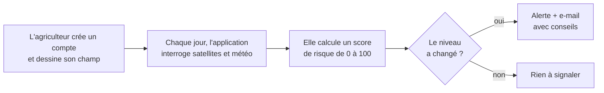

# 1. Comprendre le projet

> Ce guide s'adresse à **tout le monde** : élus, agents municipaux,
> agriculteurs, étudiants, curieux. Aucune connaissance en informatique n'est
> nécessaire.

## Sommaire

1. [À quoi sert E-commune ?](#1-à-quoi-sert-e-commune-)
2. [Le géoportail : la carte de la commune](#2-le-géoportail--la-carte-de-la-commune)
3. [Le module agriculture : surveiller ses champs par satellite](#3-le-module-agriculture--surveiller-ses-champs-par-satellite)
4. [La cartothèque : les cartes thématiques](#4-la-cartothèque--les-cartes-thématiques)
5. [L'administration](#5-ladministration)
6. [Ce que l'application ne fait pas (encore)](#6-ce-que-lapplication-ne-fait-pas-encore)
7. [Lexique](#7-lexique)

---

## 1. À quoi sert E-commune ?

Une mairie a besoin de **savoir où se trouvent les choses** sur son territoire
pour bien décider : où construire une nouvelle école, quel village est loin
d'un centre de santé, quelle piste mérite d'être réhabilitée, où manque l'eau
potable…

**E-commune** rassemble ces informations sur **une seule carte**, consultable
depuis un navigateur internet (Chrome, Firefox, Edge…), sans rien installer
sur l'ordinateur de l'utilisateur.

L'application a trois parties :

| Partie | En une phrase | Pour qui |
|---|---|---|
| **Géoportail** | La carte des infrastructures de la commune | Mairie, services techniques, population |
| **Agriculture** | La surveillance des champs par satellite, avec des alertes | Agriculteurs, coopératives, services agricoles |
| **Cartothèque** | Une bibliothèque de cartes thématiques prêtes à consulter ou imprimer | Mairie, partenaires, grand public |

### La commune couverte : Blitta 2

Blitta 2 est l'une des trois communes de la **préfecture de Blitta** (région
Centrale du Togo). Elle regroupe quatre **cantons** :

| Canton | Rôle |
|---|---|
| **Agbandi** | chef-lieu de la commune |
| **Langabou** | traversé par la route nationale N1 |
| **Koffiti** | |
| **Tcharè-Baou** | |

Cette composition est fixée par le décret publié au *Journal officiel de la
République togolaise* du 8 janvier 2018.

---

## 2. Le géoportail : la carte de la commune

Adresse : **`/geoportail/`** (par exemple http://127.0.0.1:8000/geoportail/ sur
l'ordinateur où l'application est lancée).

### Ce qu'on voit

- **Un fond de carte** au choix : *OpenStreetMap* (plan), *Satellite* (photo
  aérienne) ou *Hybride* (photo + noms).
- **Les limites** : le contour de la commune et de ses 4 cantons (en orange).
- **Les routes** : la route nationale revêtue en **rouge épais**, les pistes
  rurales en **pointillés noirs**.
- **Les infrastructures**, représentées par des petites icônes :

| Thème | Couches |
|---|---|
| Infrastructure | Lycées, collèges, jardins d'enfants, marchés |
| Hydrographie | Points d'eau autonomes (forages, puits), bornes-fontaines, châteaux d'eau |
| Santé | Formations sanitaires (USP, CMS, hôpitaux) |
| Sport et loisirs | Stades et terrains de sport |
| Agriculture | Coopératives, magasins d'intrants |

### Comment l'utiliser

1. **Se déplacer** : cliquer-glisser sur la carte. **Zoomer** : molette de la
   souris ou boutons `+` / `−` en bas à droite.
2. **Afficher des couches** : cliquer sur l'icône orange **« couches »** en haut
   à droite, puis choisir un **thème** (Santé, Infrastructure…). Changer de
   fond de carte au même endroit.
3. **Obtenir des informations** : cliquer sur une icône ou un tracé. Une bulle
   s'ouvre avec le nom, le canton, la localité, etc.
4. **Rechercher** : bouton **🔍 Rechercher** en haut, puis taper un nom (par
   exemple « Agbandi » ou « Lycée »).
5. **Outils SIG** (panneau de gauche, bouton `≡`) :
   - **📍 Localiser** : centrer la carte sur votre position (si votre appareil
     le permet) ;
   - **✏️ Dessiner** : tracer un point, une ligne ou une zone sur la carte ;
   - **📐 Mesurer** : mesurer une distance ou une surface ;
   - **Filtres & Stats** : compter les infrastructures par canton et par thème
     (combien de lycées dans le canton de Langabou ?…).

### D'où viennent les informations ?

- **À l'origine**, l'équipe du projet a relevé les données sur le terrain
  (nom des marchés, jour de marché, photos…). Ces données sont dans la base de
  données de l'auteur du projet, **pas dans le code source**.
- **Sur une nouvelle installation**, une commande reconstruit la carte à partir
  de **sources publiques** : limites officielles des Nations unies (OCHA),
  **OpenStreetMap** (la « Wikipédia des cartes », alimentée par des bénévoles)
  et l'inventaire des centres de santé de l'**OMS**.

Conséquence : certaines informations peuvent manquer ou être incomplètes.
Quand une donnée n'est pas connue, la carte affiche **« Non renseigné »** au
lieu d'inventer une valeur. **Chacun peut améliorer OpenStreetMap**
(https://www.openstreetmap.org) : les ajouts faits là-bas seront repris au
prochain import.

---

## 3. Le module agriculture : surveiller ses champs par satellite

### L'idée

Des satellites (Sentinel-2 de l'Agence spatiale européenne, MODIS de la NASA…)
photographient le Togo tous les quelques jours. En analysant les couleurs de
ces images, on peut savoir si une plante est **verte et en bonne santé** ou
**jaunie et stressée**. En y ajoutant les **relevés de pluie** et les
**prévisions météo**, on peut anticiper une sécheresse ou une inondation.

### Comment ça marche, étape par étape

1. **L'agriculteur crée un compte** et **dessine son champ** sur la carte, en
   indiquant la culture (maïs, igname…) et la date de semis.
2. **Chaque jour** (tâche automatique, par défaut à 6 h), l'application
   récupère pour chaque champ :
   - la **santé de la végétation** (indices NDVI, EVI, MSAVI) ;
   - l'**humidité** de la végétation (NDWI) ;
   - la **sécheresse** mesurée et prévue (SPI, VCI, TCI, VHI) ;
   - la **pluie** tombée (24 h, 72 h) et **prévue** (16 jours).
3. Elle combine ces indicateurs en **un score de risque de 0 à 100** :

   | Score | Niveau | Signification |
   |---|---|---|
   | 0 – 25 | 🟢 **Normal** | Tout va bien |
   | 26 – 50 | 🟡 **Vigilance** | À surveiller |
   | 51 – 75 | 🟠 **Alerte** | Agir est recommandé |
   | 76 – 100 | 🔴 **Critique** | Agir en urgence |

4. **Une alerte n'est envoyée que si le niveau change** (aggravation ou
   amélioration). On ne reçoit donc pas le même e-mail tous les jours.
5. L'e-mail explique **ce qui ne va pas** (stress hydrique, sécheresse, excès
   de pluie…), **quels indicateurs** l'ont révélé, et donne une
   **recommandation**.

### Le calendrier cultural

L'application contient aussi un **calendrier cultural** : pour chaque culture,
les mois de semis, de sarclage et de récolte, et la durée du cycle. Un
**simulateur de croissance** indique à quel stade devrait être la culture
N jours après le semis.

### À savoir

- Cette partie a besoin d'un **accès à Google Earth Engine** (service gratuit
  pour la recherche et l'usage non commercial) et d'une **adresse e-mail
  d'envoi**. Sans eux, les calculs satellites et les e-mails ne fonctionnent
  pas. Voir [le guide d'installation](2-INSTALLER-ET-LANCER.md#8-activer-le-module-agriculture-google-earth-engine).
- L'interface complète pour les agriculteurs (création de compte, dessin des
  champs, tableau de bord) est une **application séparée** (« frontend »), qui
  n'est pas dans ce dépôt. Ce dépôt contient le **serveur** (« backend ») qui
  fait les calculs et fournit les données.

---

## 4. La cartothèque : les cartes thématiques

La cartothèque est une **bibliothèque de cartes** déjà mises en page
(population, santé, éducation, agriculture…), classées par **domaine**. Chaque
carte a un titre, une description, une image, une échelle, un auteur, une
source et un statut (brouillon / publiée). Certaines peuvent être payantes.

Les cartes s'ajoutent depuis l'**administration** ; elles sont ensuite
disponibles pour l'application frontend via l'adresse `/api/cartotheque/`.

---

## 5. L'administration

Adresse : **`/admin/`**. Réservée aux gestionnaires (identifiant et mot de
passe créés lors de l'installation).

On peut y :

- gérer les **utilisateurs** (créer, désactiver, changer un mot de passe) ;
- gérer la **cartothèque** (domaines et cartes) ;
- consulter et corriger les **marchés** (avec photo) ;
- consulter les **champs**, les **alertes** envoyées, les **règles d'alerte**
  et le **calendrier cultural**.

---

## 6. Ce que l'application ne fait pas (encore)

Pour être transparent sur l'état actuel :

- **Pas de page d'accueil** : l'adresse racine du site affiche « Page non
  trouvée ». Il faut aller directement sur `/geoportail/`.
- **Données de terrain incomplètes** sur une nouvelle installation : jours de
  marché, dates d'ouverture des écoles, points d'eau, châteaux d'eau,
  coopératives… ne sont pas dans les sources publiques.
- **La carte du module agriculture** est encore centrée sur Aného et utilise un
  serveur cartographique (GeoServer) présent seulement sur l'ordinateur de
  l'auteur.
- **Les listes « Choisir canton » et « Choisir un quartier »** en haut de la
  carte restent vides (petit défaut du code, et pas de données de quartiers).
  Utilisez plutôt le filtre **Canton** du panneau *Filtres & Stats*.
- **Pas d'alerte par SMS ou WhatsApp** : seulement par e-mail (le numéro
  WhatsApp est enregistré mais pas encore utilisé).

La liste détaillée et les pistes d'amélioration sont dans
[4-AMELIORER.md](4-AMELIORER.md#3-limites-connues).

---

## 7. Lexique

| Terme | Explication simple |
|---|---|
| **SIG** | *Système d'information géographique* : un logiciel qui relie des informations à des positions sur une carte. |
| **Géoportail** | Site web qui présente des cartes et des données géographiques. |
| **Couche** | Un ensemble d'objets de même nature affichés sur la carte (ex. : la couche « marchés »). On peut l'afficher ou la masquer. |
| **Fond de carte** | L'image de base sous les couches (plan, photo satellite…). |
| **Canton** | Subdivision traditionnelle et administrative au Togo, dirigée par un chef canton. Plusieurs cantons forment une commune. |
| **Commune** | Collectivité locale dirigée par un conseil municipal et un maire (117 communes au Togo depuis 2019). |
| **USP / CMS** | *Unité de soins périphérique* / *Centre médico-social* : niveaux de formation sanitaire au Togo. |
| **EPP / CEG** | *École primaire publique* / *Collège d'enseignement général*. |
| **NDVI** | Indice de « verdure » calculé à partir d'images satellites. Proche de 1 : végétation dense et saine. Proche de 0 : sol nu ou plantes en souffrance. |
| **EVI, MSAVI** | Variantes du NDVI, plus fiables quand la végétation est très dense (EVI) ou clairsemée (MSAVI). |
| **NDWI** | Indice d'eau dans la végétation : aide à repérer le manque d'eau des plantes. |
| **SPI** | *Indice de précipitation standardisé* : compare la pluie tombée à la normale des années passées. Négatif = plus sec que d'habitude. |
| **VCI, TCI, VHI** | Indices de sécheresse : état de la végétation (VCI), température (TCI) et leur combinaison (VHI). |
| **CHIRPS / CHIRPS-GEFS** | Données de pluie observée (CHIRPS) et prévue (CHIRPS-GEFS) produites par l'Université de Californie et l'USGS. |
| **Google Earth Engine** | Service de Google qui permet de calculer ces indices sur les images satellites sans les télécharger. |
| **OpenStreetMap (OSM)** | Carte du monde libre et collaborative, alimentée par des bénévoles. |
| **API** | « Guichet » informatique par lequel une autre application demande des données au serveur. |
| **Frontend / backend** | Le frontend est ce que l'utilisateur voit (l'interface) ; le backend est le serveur qui calcule et stocke les données. Ce dépôt est surtout le backend. |
