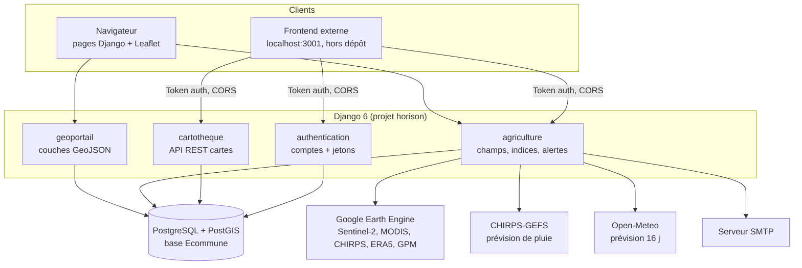
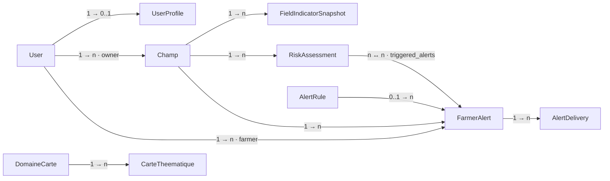
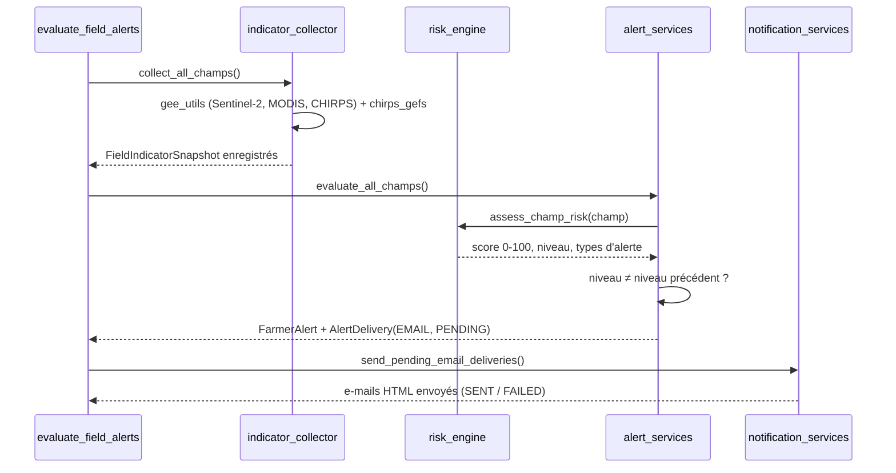

# 3. Architecture technique

> Pour les **développeurs**. Ce document décrit l'organisation du code, la
> base de données, les API, le système d'alertes et la configuration.
> Pré-requis : connaître les bases de Django.

## Sommaire

1. [Vue d'ensemble](#1-vue-densemble)
2. [Arborescence](#2-arborescence)
3. [Configuration (settings)](#3-configuration-settings)
4. [Base de données](#4-base-de-données)
5. [API et routes](#5-api-et-routes)
6. [Système d'alertes agricoles](#6-système-dalertes-agricoles)
7. [Données et sources](#7-données-et-sources)
8. [Front-end](#8-front-end)
9. [Commandes de gestion](#9-commandes-de-gestion)
10. [Sécurité](#10-sécurité)

---

## 1. Vue d'ensemble



| Couche | Technologie |
|---|---|
| Langage / framework | Python 3.12+, Django 6.0 |
| API REST | Django REST Framework 3.x, `rest_framework.authtoken`, `django-filter` |
| SIG serveur | `django.contrib.gis` (GeoDjango), GDAL/GEOS/PROJ |
| Base de données | PostgreSQL 16 + PostGIS 3.5 |
| Cartographie navigateur | Leaflet 1.9, Leaflet.draw, Turf.js 6, proj4js |
| Télédétection | Google Earth Engine (`earthengine-api`), `rasterio`, `scipy` |
| Météo | CHIRPS / CHIRPS-GEFS (UCSB), Open-Meteo |
| CORS | `django-cors-headers` |
| Déploiement | `build.sh` (Render), `gunicorn` |

---

## 2. Arborescence

```
projet_horieon/
├── manage.py                    # point d'entrée Django (DJANGO_SETTINGS_MODULE=horison.settings)
├── requirements.txt             # dépendances pip (UTF-8)
├── .env.exemple                 # modèle de configuration (copier en .env)
├── build.sh                     # build de déploiement : pip install, collectstatic, migrate
├── run_alerts.bat               # lanceur Windows de evaluate_field_alerts (chemins à adapter)
├── install_alerts_task.ps1      # crée la tâche planifiée Windows
├── commune.geojson              # ancien fichier de test (zone d'Aného, EPSG:32631), inutilisé
├── model.py                     # brouillon de modèles, inutilisé
├── urls.py, wsgi.py, asgi.py    # doublons historiques de horison/, inutilisés
│
├── horison/                     # le « projet » Django
│   ├── settings.py              # configuration (lit .env) + détection GDAL sous Windows
│   ├── urls.py                  # routes racine
│   ├── wsgi.py / asgi.py
│
├── geoportail/                  # carte communale
│   ├── models.py                # 14 couches (modèles NON gérés, managed=False)
│   ├── views.py                 # endpoints GeoJSON, recherche, toutes couches
│   ├── urls.py
│   ├── admin.py                 # admin des marchés (aperçu photo)
│   ├── management/commands/import_blitta2.py   # reconstruction des couches (données ouvertes)
│   ├── templates/index.html     # page du géoportail
│   └── static/                  # js/script.js (carte), css/, icone/*.png, images/
│
├── agriculture/                 # suivi des champs et alertes
│   ├── models.py                # Champ, CropCalendar, FieldIndicatorSnapshot, AlertRule,
│   │                            # FarmerAlert, RiskAssessment, AlertDelivery (+ 3 couches non gérées)
│   ├── views.py                 # ~25 endpoints JSON
│   ├── gee_utils.py             # tous les calculs Earth Engine (NDVI, SPI, VHI, ERA5, GPM…)
│   ├── chirps_gefs.py           # prévision de pluie CHIRPS-GEFS (rasterio)
│   ├── weather_forecast.py      # prévision Open-Meteo (sécheresse / inondation à venir)
│   ├── indicator_collector.py   # 1. collecte → FieldIndicatorSnapshot
│   ├── risk_engine.py           # 2. score de risque 0-100
│   ├── alert_services.py        # 3. création des alertes si le niveau change
│   ├── notification_services.py # 4. e-mails HTML
│   ├── management/commands/evaluate_field_alerts.py  # orchestre 1 → 4
│   ├── migrations/0008_default_alert_rules.py        # règles d'alerte par défaut
│   ├── templates/agriculture/index.html
│   └── static/js/main.js
│
├── authentication/              # inscription / connexion par jeton
│   ├── models.py                # UserProfile (secteur, WhatsApp, alertes oui/non)
│   ├── serializers.py, views.py, urls.py
│
├── cartotheque/                 # bibliothèque de cartes thématiques
│   ├── models.py                # DomaineCarte, CarteTheematique
│   ├── views.py                 # ViewSets DRF
│   ├── api_urls.py              # router DRF
│   └── fixtures/initial_domaines.json
│
├── media/                       # fichiers envoyés (photos de marchés, images de cartes)
└── docs/                        # cette documentation
```

---

## 3. Configuration (settings)

Fichier : `horison/settings.py`.

### Chargement

1. `BASE_DIR` = racine du dépôt.
2. `load_dotenv(BASE_DIR / '.env')` : les variables du fichier `.env` sont
   chargées **sans écraser** celles déjà définies dans l'environnement.
3. Fonctions utilitaires `env_bool()` et `env_list()`.

### GDAL / GEOS / PROJ

- **Windows** (`os.name == 'nt'`) : le code cherche la roue Python GDAL dans
  `sys.prefix/Lib/site-packages/osgeo` (le venv courant) et, si les fichiers
  existent, définit `GDAL_LIBRARY_PATH`, `GEOS_LIBRARY_PATH`, `PROJ_LIB`,
  `GDAL_DATA` et ajoute `osgeo` au `PATH`.
- **Linux** : rien n'est forcé ; GeoDjango trouve `libgdal` / `libgeos_c`
  installés par le système.
- `PROJ_NETWORK=OFF` : PROJ n'essaie pas de télécharger de grilles.

### Paramètres lus depuis l'environnement

Voir le tableau complet dans [2-INSTALLER-ET-LANCER.md › étape 5](2-INSTALLER-ET-LANCER.md#5-configurer-le-fichier-env).

### Autres réglages notables

| Réglage | Valeur | Remarque |
|---|---|---|
| `REST_FRAMEWORK` | `TokenAuthentication`, `AllowAny` | Chaque vue restreint elle-même si besoin |
| `CORS_ALLOW_ALL_ORIGINS` | `True` | Pratique en développement, **à restreindre en production** (`CORS_ALLOWED_ORIGINS`) |
| `CORS_ALLOW_CREDENTIALS` | `True` | |
| `X_FRAME_OPTIONS` | `ALLOW-FROM http://localhost:3001` | Directive obsolète, ignorée par les navigateurs récents |
| `STATIC_ROOT` / `MEDIA_ROOT` | `staticfiles/` / `media/` | |
| `LANGUAGE_CODE` / `TIME_ZONE` | `en-us` / `UTC` | |
| `NDVI_ALERT_THRESHOLD` | `0.35` | Seuil historique de stress hydrique |
| `DEFAULT_AUTO_FIELD` | `BigAutoField` | |

---

## 4. Base de données

Base PostgreSQL **`Ecommune`** avec l'extension **PostGIS**. Toutes les
géométries sont en **WGS 84 (EPSG:4326)**.

### 4.1 Tables gérées par les migrations



*Lecture : « Champ 1 → n FieldIndicatorSnapshot » = un champ possède
plusieurs mesures d'indicateurs.*

| Modèle | Table | Rôle |
|---|---|---|
| `authentication.UserProfile` | `authentication_userprofile` | Secteur d'activité, WhatsApp, accepte les alertes |
| `agriculture.Champ` | `agriculture_champ` | Parcelle : nom, propriétaire, culture, date de semis, `geom` (GeometryField 4326), `owner` |
| `agriculture.CropCalendar` | `agriculture_crop_calendar` | Culture, variété, type (céréale, légume, tubercule, légumineuse), durée du cycle, mois de semis / sarclage / récolte |
| `agriculture.FieldIndicatorSnapshot` | `agriculture_fieldindicatorsnapshot` | Une valeur d'indicateur pour un champ à une date (+ référence, unité, source, métadonnées JSON) |
| `agriculture.AlertRule` | `agriculture_alertrule` | Règle : indicateur, opérateur (`LT`, `LTE`, `GT`, `GTE`, `EQ`, `CHANGE_PCT`), seuil, sévérité, gabarits de message, délai anti-répétition |
| `agriculture.RiskAssessment` | `agriculture_riskassessment` | Score 0-100, niveau, sous-scores JSON, instantané des indicateurs |
| `agriculture.FarmerAlert` | `agriculture_farmeralert` | Alerte émise : type, niveau, score, indicateurs contributeurs, message, recommandation, statut (`OPEN`, `ACKNOWLEDGED`, `RESOLVED`, `EXPIRED`) |
| `agriculture.AlertDelivery` | `agriculture_alertdelivery` | Envoi d'une alerte : canal (`EMAIL`, `WHATSAPP`), destinataire, statut (`PENDING`, `SENT`, `FAILED`, `SKIPPED`), tentatives |
| `cartotheque.DomaineCarte` | `cartotheque_domainecarte` | Domaine thématique (icône Lucide, couleur, ordre) |
| `cartotheque.CarteTheematique` | `cartotheque_cartetheematique` | Carte : image, vignette, GeoJSON, centre / zoom, fond, statut (`brouillon`, `publie`…), échelle, format, prix |

Plus les tables Django standard (`auth_*`, `django_*`, `authtoken_token`).

### 4.2 Tables NON gérées (`managed = False`)

Ces modèles décrivent des tables **créées hors de Django** (import de
shapefiles avec QGIS ou `shp2pgsql`). `migrate` ne les crée pas.

| Modèle | Table | Géométrie | Champs principaux | Créée par `import_blitta2` |
|---|---|---|---|---|
| `geoportail.Commune` | `bl2` | MultiPolygon | commune, code_commu, region, prefecture | ✅ |
| `geoportail.Cantons` | `cant_bli2` | MultiPolygon | gid (PK), canton, code_canto | ✅ |
| `geoportail.routes` | `routeb2` | MultiLineString | route_type, route_clas, route_reco, route_nom | ✅ |
| `geoportail.marche` | `marches` | Point | marche_nom, jour, photo | ✅ |
| `geoportail.lycee` / `college` / `jardin` | `lyc2` / `collegeb2` / `jardb2` | Point | etablissem, etab_adr, ouverture, etabliss_1 (statut), inspection, ministere | ✅ |
| `geoportail.pea` | `pea` | Point | forage_nom, forage_typ, batiment_n | ✅ |
| `geoportail.bornefontaine` | `bornefontaines` | Point | borne_font | ✅ |
| `geoportail.chateau` | `chatea` | Point | chateau_no, organisme | ✅ |
| `geoportail.hopitale` | `formation_s` | Point | nom_fs, secteur, services_p | ✅ |
| `geoportail.terrain` | `stade_terrainbl2` | MultiPolygon | terrain, terrain_sp | ✅ |
| `geoportail.coperative` | `cooperativebl2` | Point | cooperativ, cooperat_1 | ✅ |
| `geoportail.magazinbl2` | `magazin_intrantbl2` | Point | etab_nom, organisme | ✅ |
| `agriculture.Region` | `region` | MultiPolygon | region | ❌ |
| `agriculture.Prefecture` | `couche_prefecture_utm` | MultiPolygon | prefecture | ❌ |
| `agriculture.Commune` | `communes_togo_utm` | MultiPolygon | commune, prefecture | ❌ |

Toutes les couches ponctuelles du géoportail ont en plus `canton_nom` et, sauf
exception, `nom_locali` (localité).

> Les valeurs de `routeb2.route_type` sont **utilisées par le style** de la
> carte : seules `Route nationale revêtue` et `Piste rurale` sont dessinées
> (comparaison insensible à la casse et aux accents, fonction `styleRoute`
> dans `geoportail/static/js/script.js`).

---

## 5. API et routes

Routes racine (`horison/urls.py`) : `admin/`, `auth/`, `geoportail/`,
`agriculture/`, `api/cartotheque/`, plus le service des fichiers `media/` en
mode `DEBUG`.

### 5.1 Authentification — `/auth/`

Authentification par **jeton** : envoyer l'en-tête
`Authorization: Token <clé>` (les vues agriculture acceptent aussi `Bearer`).

| Méthode | Route | Accès | Corps / réponse |
|---|---|---|---|
| POST | `/auth/register/` | public | `username, email, first_name, last_name, password, password_confirm, secteur_activite?, whatsapp?, recevoir_alertes?` → `{token, user}` |
| POST | `/auth/login/` | public | `username` (ou identifiant), `password` → `{token, user}` |
| GET | `/auth/me/` | connecté | profil de l'utilisateur |
| POST | `/auth/logout/` | connecté | supprime le jeton |

### 5.2 Géoportail — `/geoportail/`

| Méthode | Route | Réponse |
|---|---|---|
| GET | `/geoportail/` | page HTML de la carte |
| GET | `/geoportail/geojson/commune/` | FeatureCollection `bl2` |
| GET | `/geoportail/geojson/cantons/` | FeatureCollection `cant_bli2` |
| GET | `/geoportail/geojson/routes/` | `routeb2` |
| GET | `/geoportail/geojson/lycee/`, `college/`, `jardin/` | établissements scolaires |
| GET | `/geoportail/geojson/Point_eau/`, `bornefontaine/`, `chateau/` | eau |
| GET | `/geoportail/geojson/Marches/` | marchés |
| GET | `/geoportail/geojson/hopitale/` | formations sanitaires |
| GET | `/geoportail/api/layers/` | toutes les couches en un seul appel |
| GET | `/geoportail/api/search/?q=<texte>&layer=<couche>` | recherche plein texte (15 résultats max par couche) |

Les vues `terrain_geojson`, `cooperative_geojson` et `magazin_geojson` existent
dans `views.py` mais **ne sont pas routées** dans `urls.py`.

### 5.3 Agriculture — `/agriculture/`

Sauf mention contraire, les POST attendent un corps JSON. 🔒 = jeton requis ;
l'utilisateur ne voit que **ses** champs (ou tous s'il est `staff`).

| Méthode | Route | 🔒 | Rôle |
|---|---|---|---|
| GET | `/agriculture/` | | page HTML |
| GET | `api/regions/`, `api/prefectures/`, `api/communes/` | | limites administratives (tables non gérées) |
| GET | `api/ndvi-tiles/` | | URL de tuiles NDVI Earth Engine |
| POST | `api/ndvi-timeseries/` | | série NDVI mensuelle d'une zone (`zone_type`, `zone_id`, `years`) |
| POST | `api/drought-indices/` | | VHI/VCI/TCI d'une zone (`zone_type`, `zone_id`, `years`, `index_type`) |
| GET | `api/champs/geojson/` | 🔒 | champs de l'utilisateur |
| POST | `api/champs/create/` | 🔒 | créer un champ (`nom, date_semi, geom, proprietaire, type_culture`) |
| POST | `api/field-ndvi/` | 🔒 | historique d'un indice (`champ_id, index_type`) |
| POST | `api/field-indices-comparison/` | 🔒 | plusieurs indices (`champ_id, indices[]`) |
| POST | `api/field-climate/` | 🔒 | pluie CHIRPS + température ERA5 (`champ_id, start_date`) |
| POST | `api/field-climate-risk/` | 🔒 | risque climatique (`champ_id, reference_date`) |
| POST | `api/field-realtime-status/` | 🔒 | situation et prévision à 15 j : CHIRPS-GEFS, tendance CHIRPS, prévision Open-Meteo, SPI prévisionnel, alerte de synthèse |
| POST | `api/field-chirps-gefs/` | 🔒 | prévision CHIRPS-GEFS (`forecast_days`) |
| POST | `api/field-forecast-spi/` | 🔒 | SPI prévisionnel (`years_history`) |
| POST | `api/field-drought-indices/` | 🔒 | VHI/VCI/TCI d'un champ |
| GET | `api/alerts/?status=&champ_id=&limit=` | 🔒 | alertes de l'utilisateur |
| GET | `api/champ-risk/<id>/` | 🔒 | dernière évaluation de risque |
| POST | `api/evaluate-champ/` | 🔒 | évaluer un champ maintenant (`champ_id, collect, dry_run`) |
| GET | `api/crop-calendar/` | | calendrier cultural |
| POST | `api/crop-calendar/add/`, `update/<pk>/` | ⚠️ aucun | créer / modifier |
| POST, DELETE | `api/crop-calendar/delete/<pk>/` | ⚠️ aucun | supprimer |
| POST | `api/crop-calendar/simulate/` | | stade de croissance (`calendar_id, day`) |

### 5.4 Cartothèque — `/api/cartotheque/` (router DRF)

| Route | Accès | Détails |
|---|---|---|
| `domaines/` | lecture seule, public | domaines actifs ; `?search=`, `?ordering=ordre` |
| `cartes/` | lecture publique ; écriture selon les **permissions Django** (`add/change/delete_cartetheematique`) | `?statut=publie` (défaut) \| `brouillon` \| `tous`, `?domaine=<id>`, `?domaine_slug=`, `?search=`, `?ordering=` |

---

## 6. Système d'alertes agricoles

### 6.1 Chaîne de traitement

`python manage.py evaluate_field_alerts` enchaîne quatre modules :



1. **Collecte** (`indicator_collector.py`) : pour chaque champ, appelle
   `gee_utils` et `chirps_gefs`. Chaque indice est protégé : si l'un échoue,
   les autres sont quand même enregistrés.
2. **Score** (`risk_engine.py`) : 5 sous-scores de 0 à 100, pondérés :

   | Dimension | Poids | Indicateurs |
   |---|---|---|
   | Végétation | 0,30 | NDVI, EVI, MSAVI (baisse + valeur absolue) |
   | Humidité | 0,20 | NDWI, corroboré par EVI / MSAVI |
   | Sécheresse | 0,25 | SPI_30, SPI_90, SPI_FORECAST |
   | Précipitations | 0,15 | RAINFALL_24H, RAINFALL_72H (excès ou déficit) |
   | Prévision | 0,10 | SPI_FORECAST, pluie prévue |

   Les poids sont dans la constante `WEIGHTS` (leur somme doit valoir 1).
   Niveaux : 0-25 `NORMAL`, 26-50 `VIGILANCE`, 51-75 `ALERTE`, 76-100 `CRITIQUE`.
3. **Décision** (`alert_services.py`) : une alerte n'est créée **que si le
   niveau change** par rapport au dernier `RiskAssessment` (1re détection,
   aggravation, amélioration, fin d'alerte). Types :
   `STRESS_VEGETATIF`, `STRESS_HYDRIQUE`, `SECHERESSE`, `EXCES_PLUIE`,
   `GENERIC`. Un `AlertDelivery` EMAIL n'est créé que si le profil a
   `recevoir_alertes=True`.
4. **Envoi** (`notification_services.py`) : e-mail HTML (niveau, score,
   tableau des indicateurs contributeurs, recommandation).

### 6.2 Indicateurs

| Code | Source | Sens |
|---|---|---|
| `NDVI`, `EVI`, `MSAVI` | Sentinel-2 (masque nuages), via GEE | vigueur de la végétation |
| `NDWI` | Sentinel-2 | eau dans la végétation |
| `VCI`, `TCI`, `VHI` | MODIS NDVI (MOD13A2) + température de surface (MOD11A2), via GEE | sécheresse (végétation, température, combiné) ; la collecte quotidienne enregistre le **VHI** |
| `NCWSI` | MODIS NDVI / température de surface, via GEE | stress hydrique normalisé |
| `SPI_30`, `SPI_90` | CHIRPS, climatologie sur 10 ans | anomalie de pluie observée |
| `SPI_FORECAST` | CHIRPS-GEFS | anomalie de pluie prévue sur 15 jours |
| `RAINFALL_24H`, `RAINFALL_72H` | GPM IMERG (NASA), repli sur CHIRPS-GEFS | pluie récente |

`weather_forecast.py` (Open-Meteo, sans clé) détecte en plus les **épisodes
secs** prévus (7 / 10 / 14 jours consécutifs < 1 mm) et les **cumuls
d'inondation** sur 3 jours (60 / 100 / 150 mm).

### 6.3 Earth Engine

`gee_utils.initialize_ee()` lit la clé de compte de service
`ee-koutoumbogajules-c99000ca569e.json` **dans le répertoire courant**, puis
appelle `ee.Initialize(credentials)`. Principales fonctions :
`get_monthly_ndvi_series`, `get_8_day_ndvi_series`, `get_field_ndvi_history`,
`get_field_indices_history`, `get_chirps_precipitation_series`,
`get_era5_temperature_series`, `compute_climate_risk`,
`compute_observed_spi_windows`, `get_realtime_precipitation`,
`get_drought_index_map_url`.

---

## 7. Données et sources

### 7.1 Couches du géoportail

Les données de terrain d'origine sont dans la base de l'auteur. Sans elles,
`python manage.py import_blitta2` reconstruit les couches :

| Étape | Source | Détail |
|---|---|---|
| Cantons | [OCHA COD-AB Togo](https://data.humdata.org/dataset/cod-ab-tgo), niveau ADM3 | P-codes `TG010101` Agbandi, `TG010110` Langabou, `TG010109` Koffiti, `TG010115` Tcharè-Baou |
| Commune | Union des 4 cantons | Composition : décret publié au [JO du 08/01/2018](https://jo.gouv.tg/sites/default/files/JO/JOS_08_01_18-63e%20ANNEE%20N%C2%B01.pdf), en application de la loi n°2017-008 |
| Infrastructures | OpenStreetMap via Overpass | Emprise des 4 cantons, puis découpage au contour de la commune |
| Santé | [Inventaire OMS/KEMRI](https://data.humdata.org/dataset/health-facilities-in-sub-saharan-africa) (Maina et al., 2019) | Rapprochement à 2,5 km avec les objets OSM (coordonnées arrondies) |

Règles de correspondance OSM :

| Couche | Critère OSM |
|---|---|
| Routes | `highway=trunk/primary` → *Route nationale revêtue* ; `secondary/tertiary/unclassified/track` → *Piste rurale* (sauf réf. `N…` revêtue) |
| Lycées / collèges / jardins | `amenity=school/kindergarten` classé par nom (`Lycée`, `CEG`, `Collège`, `Jardin`…) ; les écoles primaires n'ont pas de couche |
| Santé | `amenity=hospital/clinic/doctors/health_post`, `healthcare=*` ; type déduit du nom (USP, CMS, CHP…) ; doublons < 50 m fusionnés |
| Marchés | `amenity=marketplace` |
| Points d'eau | `man_made=water_well/borehole` (type selon `pump=*`) |
| Bornes-fontaines | `amenity=drinking_water/water_point`, `man_made=water_tap` |
| Châteaux d'eau | `man_made=water_tower`, `storage_tank` (+ `content=water`) |
| Terrains | `leisure=pitch/stadium` (polygones) |
| Coopératives / intrants | `office=cooperative`, `shop=agrarian/farm` |

Canton : intersection spatiale. Localité : `place=*` le plus proche.
Valeur inconnue : `Non renseigné`.

> **Licences** : les données OSM sont sous licence **ODbL**. Toute carte
> publiée doit mentionner « © contributeurs OpenStreetMap ».

### 7.2 Cartothèque

`cartotheque/fixtures/initial_domaines.json` : 14 domaines thématiques.

---

## 8. Front-end

### Pages servies par Django

- `geoportail/templates/index.html` + `geoportail/static/js/script.js` :
  carte Leaflet centrée sur `[8.08, 1.12]` (zoom 14), fonds OSM / Esri /
  Google, couches GeoJSON chargées en parallèle (`initMap`), icônes dans
  `static/icone/`, outils de dessin et de mesure (Leaflet.draw + Turf),
  filtres et statistiques par canton.
  `scripts.js` est une ancienne version reposant sur un GeoServer local
  (`localhost:8089`) ; seul `script.js` est chargé par le gabarit.
- `agriculture/templates/agriculture/index.html` + `static/js/main.js` :
  carte simple (centrée sur Aného, couches GeoServer locales).

> **Fond OSM** : Django envoie `Referrer-Policy: same-origin` par défaut. Les
> couches de tuiles OSM déclarent donc
> `referrerPolicy: 'strict-origin-when-cross-origin'` ; sans cette option,
> OSM répond 403 « Access blocked ».

### Frontend externe

La configuration CORS (`localhost:3001`), l'authentification par jeton et les
icônes « Lucide » de la cartothèque indiquent une application frontend
séparée (probablement React), **absente de ce dépôt**, qui consomme les API
`/auth/`, `/agriculture/api/` et `/api/cartotheque/`.

---

## 9. Commandes de gestion

| Commande | Rôle |
|---|---|
| `python manage.py migrate` | crée / met à jour les tables gérées |
| `python manage.py loaddata cartotheque/fixtures/initial_domaines.json` | domaines de la cartothèque |
| `python manage.py import_blitta2 [--cache-dir D] [--refresh] [--sans-oms]` | reconstruit les couches du géoportail (**écrase** leur contenu) |
| `python manage.py evaluate_field_alerts [--champ-id N] [--dry-run] [--no-collect] [--no-email]` | chaîne d'alertes complète |
| `python manage.py createsuperuser` | compte administrateur |
| `python manage.py collectstatic` | copie les fichiers statiques dans `staticfiles/` (production) |

---

## 10. Sécurité

- **Secrets** : uniquement dans `.env` ou les variables d'environnement.
  `.env`, les clés `ee-*.json`, `db.sqlite3`, `*.log` et `staticfiles/` sont
  ignorés par Git.
- **Historique Git** : d'anciens commits contiennent des mots de passe
  d'application Gmail et une `SECRET_KEY`. Ils doivent être **révoqués**
  (voir la PR n°1). Les retirer du code ne les efface pas de l'historique.
- **Points à durcir** avant une mise en ligne (détails dans
  [4-AMELIORER.md](4-AMELIORER.md)) :
  - endpoints `crop-calendar` add / update / delete sans authentification et
    exemptés de CSRF ;
  - `CORS_ALLOW_ALL_ORIGINS = True` ;
  - `DEBUG` doit rester à `False` en production (c'est la valeur par défaut) ;
  - le mot de passe `postgres` par défaut (`1234`) doit être changé.
