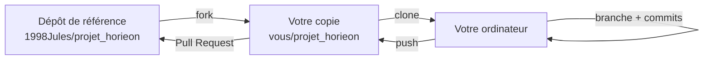

# 4. Améliorer le projet

> Pour toute personne qui veut **faire évoluer** E-commune : développeurs,
> étudiants, bénévoles. Ceux qui ne codent pas peuvent aussi aider : voir
> [Contribuer sans coder](#5-contribuer-sans-coder).

## Sommaire

1. [Proposer une modification (fork et Pull Request)](#1-proposer-une-modification-fork-et-pull-request)
2. [Recettes pas à pas](#2-recettes-pas-à-pas)
3. [Limites connues](#3-limites-connues)
4. [Feuille de route proposée](#4-feuille-de-route-proposée)
5. [Contribuer sans coder](#5-contribuer-sans-coder)

---

## 1. Proposer une modification (fork et Pull Request)

Le dépôt de référence est **https://github.com/1998Jules/projet_horieon**.
Si vous n'en êtes pas collaborateur, passez par un **fork** (votre copie
personnelle) et une **Pull Request** (PR : demande d'intégration).



### Étapes

```bash
# 1. Une seule fois : forker sur GitHub (bouton « Fork »), ou avec GitHub CLI :
gh repo fork 1998Jules/projet_horieon --clone
cd projet_horieon

# 2. Pour chaque amélioration : partir d'une version à jour
git checkout main
git pull origin main
git checkout -b corrige-selection-canton     # nom de branche explicite

# 3. Modifier, puis vérifier (voir la check-list ci-dessous)

# 4. Enregistrer
git add fichier1 fichier2
git commit -m "Corrige la liste « Choisir canton » du géoportail"

# 5. Publier et proposer
git push -u origin corrige-selection-canton    # origin = votre fork
gh pr create --repo 1998Jules/projet_horieon --fill
```

### Check-list avant d'ouvrir une PR

- [ ] `python manage.py check` ne signale aucune erreur.
- [ ] `python manage.py makemigrations --check --dry-run` : si vous avez
      modifié un modèle, la migration est incluse dans la PR.
- [ ] Les pages touchées ont été testées dans le navigateur, **console
      JavaScript comprise** (F12 › Console).
- [ ] **Aucun secret** dans les fichiers : mots de passe, `SECRET_KEY`, clés
      `ee-*.json`, fichier `.env`.
- [ ] Les fichiers sont en **UTF-8**. Sous Windows, `pip freeze > requirements.txt`
      dans PowerShell produit de l'UTF-16 que `pip` ne sait pas relire :
      préférez `pip freeze | Out-File -Encoding utf8 requirements.txt`, ou
      éditez le fichier à la main.
- [ ] Pas de fichiers générés : `__pycache__/`, `staticfiles/`, `db.sqlite3`,
      `*.log` (déjà dans `.gitignore`).
- [ ] La description de la PR explique **quoi**, **pourquoi** et **comment
      c'est testé**.
- [ ] La documentation (`docs/`) est mise à jour si le comportement change.

### Conventions

- Code, commentaires et messages de commit **en français** (comme le reste du
  projet), noms de variables en anglais ou en français selon le fichier
  modifié.
- Un commit = une idée. Message à l'infinitif ou au présent :
  « Ajoute… », « Corrige… ».
- Configuration : jamais de valeur sensible dans le code ; ajoutez une
  variable dans `.env.exemple` et lisez-la avec `os.environ.get(...)` dans
  `horison/settings.py`.

---

## 2. Recettes pas à pas

### 2.1 Ajouter une couche au géoportail

Exemple : une couche « Mairies ».

1. **Modèle** (`geoportail/models.py`) :

   ```python
   class mairie(models.Model):
       canton_nom = models.CharField(max_length=100)
       nom = models.CharField(max_length=100)
       geom = models.PointField(srid=4326)

       class Meta:
           db_table = "mairies"
           managed = False   # comme les autres couches ; ou True pour qu'une migration crée la table
   ```

   Avec `managed = False`, créez la table vous-même (import QGIS,
   `shp2pgsql`), ou ajoutez son remplissage à `import_blitta2`, qui crée
   automatiquement les tables manquantes de l'application `geoportail`.

2. **Vue** (`geoportail/views.py`), sur le modèle des autres :

   ```python
   def mairie_geojson(request):
       qs = mairie.objects.exclude(geom__isnull=True)
       geojson = serialize('geojson', qs, geometry_field='geom', fields=('canton_nom', 'nom'))
       return HttpResponse(geojson, content_type='application/json')
   ```

3. **Route** (`geoportail/urls.py`) :
   `path('geojson/mairie/', views.mairie_geojson, name='mairie_geojson'),`

4. **Carte** (`geoportail/static/js/script.js`) :
   - une icône dans `geoportail/static/icone/mairie.png` et sa déclaration
     `L.icon(...)` à côté de `infraIcons` ;
   - la couche : `geoLayers["Mairies"] = L.geoJSON(null, { pointToLayer: ..., onEachFeature: ... });`
   - son chargement dans `initMap()` :
     `loadGeoJSON("/geoportail/geojson/mairie/", geoLayers["Mairies"]),`
   - son rattachement au bon **thème** dans le panneau des couches.

5. **Recherche** (facultatif) : ajouter la couche à `SEARCHABLE_LAYERS` dans
   `views.py`.

6. **Tester** : `/geoportail/geojson/mairie/` renvoie une FeatureCollection,
   puis la couche apparaît sur la carte.

### 2.2 Mettre à jour les données depuis OpenStreetMap

Après des ajouts dans OpenStreetMap :

```bash
python manage.py import_blitta2 --refresh
```

`--refresh` retélécharge les sources au lieu d'utiliser le cache
(`%TEMP%\horieon_import` par défaut, modifiable avec `--cache-dir`).

### 2.3 Adapter l'import à une autre commune

Dans `geoportail/management/commands/import_blitta2.py` :

1. remplacez le dictionnaire `CANTONS` par les **P-codes COD-AB** des cantons
   de la commune (liste dans le fichier `tgo_admin3.geojson` du jeu
   [cod-ab-tgo](https://data.humdata.org/dataset/cod-ab-tgo)) et leurs noms
   officiels ;
2. adaptez le nom et les codes de la commune dans `load_boundaries()` ;
3. changez le centre de la carte dans `geoportail/static/js/script.js`
   (`setView([lat, lon], zoom)`).

La composition des communes est fixée par le décret publié au *Journal
officiel* du 8 janvier 2018 (application de la loi n°2017-008).

### 2.4 Ajuster le score de risque agricole

- **Pondérations** : constante `WEIGHTS` dans `agriculture/risk_engine.py`
  (la somme doit rester égale à 1, une assertion le vérifie).
- **Seuils d'une dimension** : fonctions `_score_vegetation`,
  `_score_humidity`, `_score_drought`, `_score_rainfall`, `_score_forecast`.
- **Niveaux** : `_level_from_score`.
- **Messages et recommandations** : `ALERT_TEMPLATES` dans
  `agriculture/alert_services.py`.
- **Règles d'alerte** : modèle `AlertRule`, modifiable depuis `/admin/`
  (règles par défaut : migration `0008_default_alert_rules.py`).

Testez sans rien envoyer :
`python manage.py evaluate_field_alerts --champ-id <id> --dry-run`.

### 2.5 Ajouter un indicateur agricole

1. Ajoutez son code dans `FieldIndicatorSnapshot.INDEX_CHOICES`
   (`agriculture/models.py`), puis `python manage.py makemigrations agriculture`.
2. Calculez-le dans `gee_utils.py` (ou un nouveau module).
3. Collectez-le dans `indicator_collector.py`.
4. Utilisez-le dans une dimension de `risk_engine.py`.

### 2.6 Ajouter l'envoi par WhatsApp

Le modèle est prêt (`AlertDelivery.CHANNELS` contient `WHATSAPP`,
`UserProfile.whatsapp` stocke le numéro). Il reste à :

1. créer les `AlertDelivery(channel="WHATSAPP")` dans `alert_services.py` ;
2. écrire `send_pending_whatsapp_deliveries()` (API WhatsApp Business, ou
   un fournisseur SMS comme Twilio) dans `notification_services.py` ;
3. l'appeler depuis `evaluate_field_alerts`.

---

## 3. Limites connues

Classées par gravité. Les numéros de ligne correspondent à la version de ce
document.

### Sécurité

| # | Problème | Où | Piste |
|---|---|---|---|
| S1 | Des mots de passe Gmail et une `SECRET_KEY` sont **dans l'historique Git** | anciens commits | Les **révoquer** côté Google et en production. Réécrire l'historique (`git filter-repo`) ne suffit pas si le dépôt a été cloné |
| S2 | `crop-calendar/add`, `update`, `delete` : **aucune authentification**, CSRF désactivé | `agriculture/views.py` (`add_crop_calendar`, `update_crop_calendar`, `delete_crop_calendar`) | Ajouter `@require_api_user` + vérification `is_staff` |
| S3 | `CORS_ALLOW_ALL_ORIGINS = True` | `horison/settings.py:110` | En production : `CORS_ALLOWED_ORIGINS` lu depuis `.env` |
| S4 | Mot de passe base par défaut `1234` | `settings.py`, exemples | Imposer `DB_PASSWORD` en production |

### Fonctionnement

| # | Problème | Où | Piste |
|---|---|---|---|
| F1 | Pas de page d'accueil (404 sur `/`) | `horison/urls.py` | `path('', RedirectView.as_view(url='/geoportail/'))` |
| F2 | La liste « Choisir canton » reste vide : le code lit `properties.cant`, l'API renvoie `canton` | `geoportail/static/js/script.js:398-401` | Lire `feature.properties.canton` ; faire zoomer la carte sur le canton choisi |
| F3 | Pas de couche « quartiers » (`allQuartiers` jamais rempli) | `script.js` | Ajouter une couche quartiers (voir 2.1) |
| F4 | Vues `terrain_geojson`, `cooperative_geojson`, `magazin_geojson` non routées | `geoportail/urls.py` | Ajouter les `path(...)` et charger les couches dans `initMap()` |
| F5 | `api/champs/` pointe vers `ndvi_timeseries` (copier-coller) | `agriculture/urls.py:22` | Vérifier l'usage côté frontend, puis corriger ou supprimer |
| F6 | Tables `region`, `couche_prefecture_utm`, `communes_togo_utm` absentes : erreur 500 sur `api/regions/`, `prefectures/`, `communes/` | `agriculture/models.py` | Les remplir depuis COD-AB (ADM1, ADM2, communes) avec une commande d'import |
| F7 | Carte agriculture centrée sur Aného, couches GeoServer `localhost:8089` | `agriculture/static/js/main.js` | Centrer sur Blitta 2, servir les couches depuis Django |
| F8 | Clé Earth Engine : nom de fichier codé en dur, chemin relatif au dossier de lancement | `agriculture/gee_utils.py:14` | Variable `GEE_SERVICE_ACCOUNT_KEY` (chemin absolu) + `GEE_PROJECT` dans `.env` |
| F9 | `run_alerts.bat` et `install_alerts_task.ps1` contiennent des chemins `D:\Horison\...` | racine | Chemins relatifs (`%~dp0`) et venv `.venv` |
| F10 | Réponses GeoJSON sans `charset` | `geoportail/views.py` | `content_type='application/json; charset=utf-8'` |
| F11 | Langue et fuseau `en-us` / `UTC` | `settings.py:204` | `fr-fr` et `Africa/Lome` (même heure qu'UTC) |
| F12 | `X_FRAME_OPTIONS = "ALLOW-FROM ..."` obsolète | `settings.py:219` | En-tête `Content-Security-Policy: frame-ancestors` |
| F13 | Alertes seulement par e-mail | `notification_services.py` | Voir 2.6 |

### Qualité du code

| # | Problème | Piste |
|---|---|---|
| Q1 | **Aucun test automatisé** (`tests.py` vides) | Commencer par les vues GeoJSON, `risk_engine` (fonctions pures, faciles à tester) et `import_blitta2` |
| Q2 | Fichiers en double ou inutilisés à la racine : `urls.py`, `wsgi.py`, `asgi.py`, `__init__.py`, `model.py`, `commune.geojson`, et `geoportail/static/js/scripts.js` | Vérifier qu'aucun déploiement ne les utilise, puis les supprimer |
| Q3 | Fonctions redéfinies dans le même fichier (ex. `geojson_to_ee_geometry` deux fois dans `gee_utils.py`, imports répétés dans `views.py`) | Nettoyage |
| Q4 | Noms de tables et de modèles hétérogènes (`chatea`, `formation_s`, classes en minuscules) | Harmoniser lors d'une future migration de données |
| Q5 | Pas d'intégration continue | GitHub Actions : `pip install`, `manage.py check`, tests, avec un service PostGIS |

---

## 4. Feuille de route proposée

| Priorité | Objectif | Tâches | Effort |
|---|---|---|---|
| **P0 — urgent** | Sécurité | S1 (révocation des secrets), S2, S3 | ½ journée |
| **P1** | Application utilisable partout | F1, F2, F6, F8, F9 | 2 à 3 jours |
| **P1** | Fiabilité | Q1 (premiers tests), Q5 (CI) | 2 jours |
| **P2** | Données | Campagne de collecte terrain (jours de marché, points d'eau, châteaux d'eau, coopératives) ; contribution à OpenStreetMap ; couche quartiers (F3) ; couches F4 | variable |
| **P2** | Agriculture | F7 ; WhatsApp / SMS (F13) ; tableau de bord des alertes dans l'admin | 1 à 2 semaines |
| **P3** | Confort | Page d'accueil, interface mobile, export PDF des cartes de la cartothèque, traduction en langues locales (éwé, kabiyè…) | variable |

---

## 5. Contribuer sans coder

- **Compléter OpenStreetMap** (https://www.openstreetmap.org, compte
  gratuit) : ajouter un marché, un forage, une école, le nom d'une piste.
  Ces ajouts sont repris au prochain `import_blitta2 --refresh`. Les
  applications mobiles **StreetComplete** ou **Every Door** permettent de le
  faire sur le terrain.
- **Signaler une erreur** : ouvrir une *issue* sur
  https://github.com/1998Jules/projet_horieon/issues en décrivant ce qui ne va
  pas (lieu, capture d'écran).
- **Collecter des données de terrain** (formulaire papier ou application
  comme KoboToolbox / ODK) : nom, position GPS, canton, localité, et selon le
  type : jour de marché, type de pompe, statut public / privé, date
  d'ouverture…
- **Tester** une nouvelle version et faire part de vos retours.
- **Améliorer cette documentation** : une explication pas claire est un défaut
  comme un autre.
